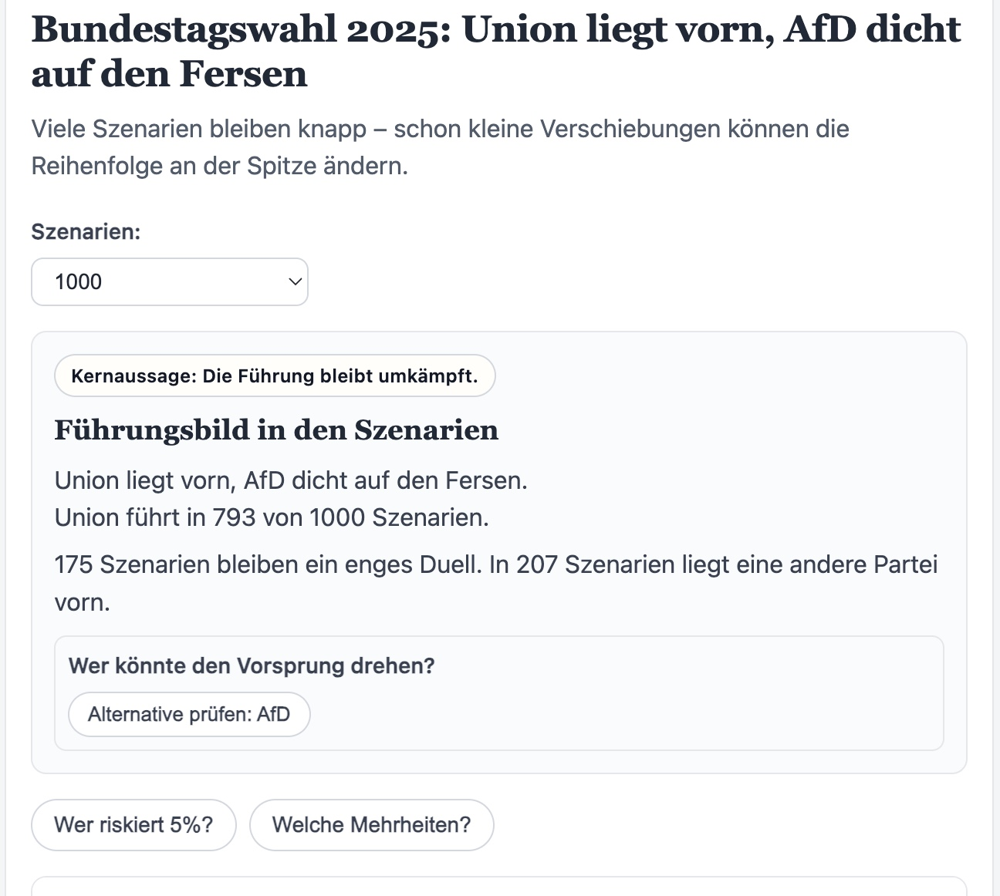
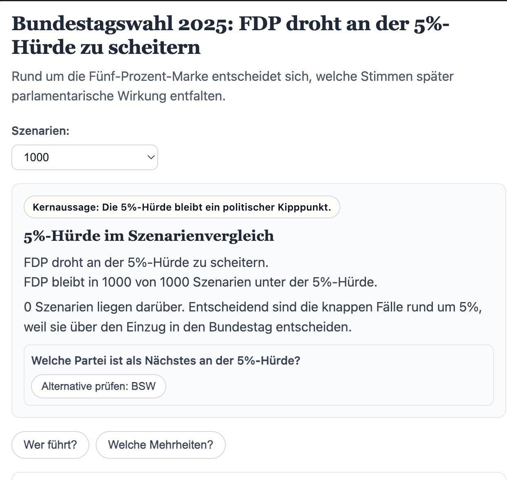
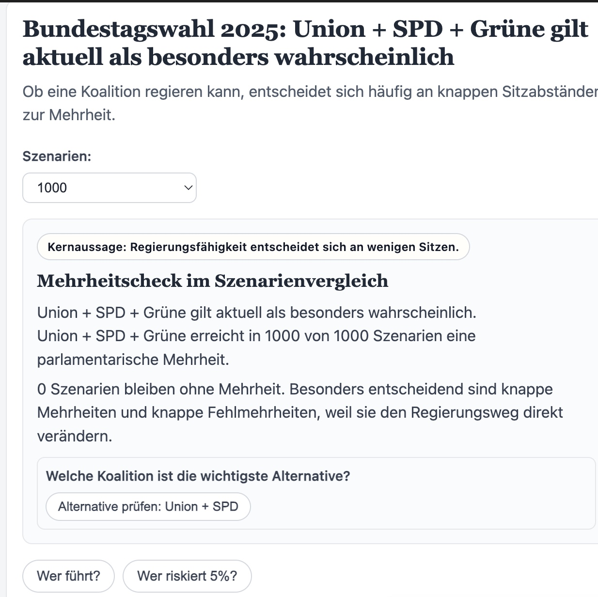

# Prompt Log

This file documents all AI-assisted interactions in the project.

---

### 1. Project Setup - New Vite Project Creation

**Model:** Claude Haiku 4.5

**Request:** Create a new Vite project for a D3 visualization with the following structure:

In the .github folder, create a file named copilot-instructions.md containing the instructions from the previous project.

Create a Dok folder in the project root containing:

visualisierungs-kontext.md containing the context from the previous project.

In the src folder, create two files:

main-stable.js

main-test.js

In the project root, create two entry points:

index-stable.html

index-test.html

Also create:

prompt-log.md

changelog.md

README.md

The folder structure should mirror the previous project exactly, including .vscode, .gitignore, and .nojekyll files.

**Action:**

- ✅ Created directory structure (.github/, Dok/, src/, .vscode/)
- ✅ Copied copilot-instructions.md from previous project to .github/
- ✅ Copied visualisierungs-kontext.md from previous project to Dok/
- ✅ Created main-stable.js and main-test.js in src/ with starter content
- ✅ Created index-stable.html and index-test.html with basic HTML structure
- ✅ Created initial changelog.md with semantic versioning format
- ✅ Created .vscode/settings.json with default preview path
- ✅ Created .gitignore with standard exclusions
- ✅ Created .nojekyll empty file
- ✅ Created prompt-log.md with append anchor

**Status:** ✅ Completed

---

### 2. Prettier Formatter Workspace Configuration

**Model:** Claude Haiku 4.5

**Request:** Please configure this workspace so that the extension "Prettier – Code formatter" (esbenp.prettier-vscode) is used as the default formatter for all relevant file types and enable format on save.

**Action:**

- ✅ Created `.vscode/` directory
- ✅ Created `.vscode/settings.json` with Prettier as default formatter for Markdown, JSON, HTML, and JavaScript files
- ✅ Enabled `editor.formatOnSave` for automatic formatting

**Status:** ✅ Completed

---

### 3. Test Environment - Mehr Whitespace zwischen Panel und Visualisierung

**Model:** GPT-5.3-Codex

**Request:** Please follow copilot-instructions.md. In the test environment (index-test.html / main-test.js), increase whitespace and separation between:
(A) the top test variant system panel and
(B) the D3 visualization area below.

**Action:**

- ✅ `index-test.html` angepasst: separates Top-Panel (`.test-variant-panel`) und separater Visualisierungsbereich (`#visualization`) mit deutlich größerem vertikalem Abstand (`margin-bottom: 32px`) und klaren Begrenzungen.
- ✅ Whitespace erhöht (Body- und Container-Padding auf 24px), damit die Bereiche auch visuell klar getrennt bleiben.
- ✅ Stable/Test-Trennung eingehalten: Änderung nur in Test-Datei, keine Anpassung an `index-stable.html` oder `src/main-stable.js`.

**Status:** ✅ Completed

---

### 4. Start Environment - D3 Szenario-Landschaft nach Kontextregeln

**Model:** GPT-5.3-Codex

**Request:** Use visualisierung-kontext.md (conceptual authority) and copilot-instructions.md (operational rules) as binding references to create the d3 visualization. The visualization concept is fixed: - A landscape of identically structured microcharts/small multiples (Monte Carlo election outcomes). - The task structure is fixed. Work only in the test environment: main-start.js / index-start.html.

**Action:**

- ✅ `index-start.html` von Platzhalter auf eine vollständige Start-Oberfläche umgestellt (deutsche Headline, Aufgaben-Navigation, Steuerbereich, Zusammenfassung, Szenario-Landschaft, Legende).
- ✅ `src/main-start.js` vollständig implementiert: Laden des fixen Datensatzes (`data/poll-data.json`), Erzeugung von 100 Monte-Carlo-Szenarien, identische Microchart-Struktur und Reorganisation nach den festen Aufgaben (Task 1, Task 2a, Task 2b, Task 3).
- ✅ Parteifarben gemäß bindender Farbdefinition verwendet und Szenarien ausschließlich aus den autoritativen Eingangswerten abgeleitet.
- ✅ GitHub-Pages-kompatiblen relativen Script-Pfad in `index-start.html` gesetzt.

**Status:** ✅ Completed

---

### 5. Enhancements: 100/1000 Toggle, Neutral Labels, Coalition Rules

**Model:** Claude Haiku 4.5

**Request:** Goal:
Implement only the changes below.
The rest of the visualization must remain completely unchanged —
no structural, visual, stylistic, logical or architectural changes beyond the explicitly listed modifications are allowed.

Do not refactor, rename, reorganize, redesign, or optimize unrelated parts of the code.

1. Scenario scale: 100 ↔ 1000 toggle (and keep it readable)

- Add a simple UI switch (e.g., segmented control or dropdown) to toggle between 100 and 1000 Monte Carlo scenarios.
- Default can be 100 (fast) but switching to 1000 must be supported.
- Keep the small-multiples structure conceptually identical (many identically structured microcharts).

The visualization must be transformed so it remains understandable with 1000 scenarios:

- maintain clear grouping/sorting
- avoid tiny illegible tiles
- keep the grid scannable (e.g., responsive columns, consistent tile size, paging/virtualization only if necessary—prefer minimal changes)

Constraints:

- Do not alter dataset.
- nsure sorting/grouping logic still works for both sizes.

2. Remove visible task labeling / prototype framing (news-ready)

The visible UI must no longer show prototype-like tab/task navigation:

- "Task 1"
- "Task 2a"
- "Task 2b"
- "Task 3"

Important: This change is label/text-level only, not a redesign. Keep the current interaction pattern (same control count & type) and only replace the visible "Task …" wording with neutral newsroom labels.

Do not change which focus modes exist, only their labels.

After implementation please add this to the language part of copilot-instructions.md: Remove visible task labeling / prototype framing (news-ready). The visible UI must no longer show prototype-like tab/task navigation.

3. Coalition majority view
   Apply these rules only to coalition generation + coalition dropdown/list + coalition majority calculations:

3a) Exclusions

- Exclude any coalition that includes AfD.
- Exclude any coalition that includes both Union and LINKE (Union+LINKE must never appear, also not inside 3- or 4-party coalitions).

3b) Allowed party pool

- Only build coalitions from: Union / SPD / Grüne / FDP / LINKE / BSW

3c) Coalition sizes

- Allow: 2-party, 3-party, and 4-party coalitions.

3d) Visibility rule

- Show all coalition options that achieve a majority in at least 1 scenario (count > 0), subject to exclusions above.
- Do not hide other Linke coalitions (e.g., SPD+Grüne+Linke) unless they violate exclusions or have count = 0.

After implementation add to the language part of Visualization Context & Framework.md exactly:

- Exclude any majority constellation that includes AfD (no "Union + AfD", etc.).

- Exclude any coalition option that combines Union + LINKE (no "Union + LINKE", including 3-party and 4-party coalitions containing both).

Definition of Done:

The work is done when all of the following are true:
No unintended changes

- UI controls (type, order, placement, spacing, styling) are unchanged except:
- Scenario toggle works
  -> A UI control exists to switch between 100 and 1000 scenarios.
  -> Switching updates the visualization correctly (re-render / recompute scenarios as needed).
  -> No dataset modifications occurred.

- 1000 scenarios remain readable
  -> The small-multiples layout remains scannable and not reduced to illegible tiles.
  -> Grouping/sorting logic still functions for both 100 and 1000.

- No visible "Task" framing
  -> The UI shows no "Task 1/2a/2b/3" wording and no task-tab prototype navigation.
  -> The visualization reads like a newsroom-ready graphic with neutral German labels.

- Coalition logic complies
  -> No coalition involving AfD is shown or counted in coalition UI.
  -> Only coalitions from Union/SPD/Grüne/FDP/Linke are considered.
  -> 2- and 3-party coalitions are included.
  -> The coalition selector/list shows all coalitions that occur in ≥1 scenario and none that occur in 0 scenarios.
  -> Works correctly for both 100 and 1000 scenarios.

- Documentation updates are applied
  -> copilot-instructions.md contains the exact additional language rule specified above.
  -> Visualization Context & Framework.md contains the exact coalition restriction text specified above.

- Copilot checklist fulfilled
  -> Errors validated on modified files, changelog updated, prompt-log updated, and stable/test separation remains intact

**Action:**

- ✅ `index-start.html`: Added scrollable landscape (`max-height: 74vh; overflow: auto`) for 1000-scenario readability; updated headline text to remove hard-coded "100".
- ✅ `src/main-start.js`: Implemented 100/1000 toggle in `sub-controls` section; added `scenarioCount` to state; created `regenerateScenarios()` to rebuild scenario set and coalition options dynamically.
- ✅ Removed all visible "Task 1/2a/2b/3" labels. Mode buttons now display: "Führung", "Abstand an der Spitze", "5%-Hürde", "Mehrheiten".
- ✅ Replaced static `COALITION_OPTIONS` with dynamic `buildCoalitionOptions()` function; added `combinations()` helper to generate all 2-, 3-, 4-party options.
- ✅ Applied coalition exclusion rules: filtered out all coalitions including AfD and all Union+LINKE combinations (2-4 party).
- ✅ Coalition selector now only shows options with count > 0 (≥1 majority scenario).
- ✅ All headlines use `state.scenarioCount` dynamically (remove hard-coded "100 Szenarien").
- ✅ `.github/copilot-instructions.md`: Added exact specified language rule to journalistic language section.
- ✅ `Dok/Visualization Context & Framework.md`: Added exact specified coalition exclusion text to Task 3 section.
- ✅ Error validation: All modified files (HTML, JS, MD) report no errors.
- ✅ Changelog updated with version 0.1.3 (PATCH) covering toggle, neutral labels, coalition rules.
- ✅ Stable/Test separation verified: No changes to `index-stable.html` or `src/main-stable.js`.

**Status:** ✅ Completed

---

### 6. Overall Impression & Layout Audit (Pre-Check ohne Implementierung)

**Model:** GPT-5.3-Codex

**Request:** <attachment id="prompt:Overall Impression & Layout.prompt.md" filePath="/Users/felina/Documents/Master HAW/Masterarbeit/visualisierung-projekt2/.github/prompts/Overall Impression & Layout.prompt.md">
Prompt instructions file:

- ***

## Goal

Improve the visualization’s **overall impression** so it clearly functions as a **journalistic explanatory tool** — calm, structured, engaging — rather than a technical statistical graphic.

Strengthen:

- visual hierarchy
- spatial organization
- layout stability
- consistency across Task 1–3
- robustness across repeated iterations

This is a controlled refinement phase.

---

## Anchor: Binding Rules (Do not restate — enforce)

All work in this iteration must comply with the **Overall Impression & Layout** section and general practices in `copilot-instructions.md` and must remain consistent with the project’s conceptual framework in `Dok/Visualization Context & Framework.md`, specifically:

- In `copilot-instructions.md`:
  - **Colour & Design System (BINDING)**
  - **Layout & Spacing Rules (MANDATORY)**
  - **Data Authority & Dataset Integrity (MANDATORY)**
  - **Start, Stable vs Test Environment (ARCHITECTURE RULE)**

- In `Dok/Visualization Context & Framework.md`:
  - The visualization’s role as a journalistic explanatory tool
  - The scenario-card landscape concept (consistency and comparability across tasks/states)
  - The fixed task structure (Task 1–3) as the interpretive framework

Do **not** repeat those rules in your response.  
Instead, **audit against them** and **apply them with a sharpened eye**.

---

## Scope

This iteration focuses on **layout, structure, and design system coherence**.

You are allowed to:

- Identify and fix structural weaknesses
- Improve hierarchy and grouping
- Adjust spacing, alignment, and visual emphasis
- Clarify component relationships
- Remove layout regressions
- Strengthen consistency through explicit rules (without changing meaning)

Data mapping and interaction logic remain stable unless a minimal UI adjustment is strictly necessary.

---

## When to Introduce Test Variants

Do **not** automatically create layout variants.

However, if you identify a **structural decision point** with multiple plausible directions (i.e., a choice that changes the layout architecture rather than fixing a defect), such as:

- Small multiples arrangement (row vs. column vs. grid)
- Filter placement architecture (top bar vs. side panel)
- Panel grouping logic
- Entry hierarchy distribution
- Comparison layout structures

Then:

- Propose 2–3 clearly differentiated structural alternatives.
- Describe them as selectable variants for the existing test variant system (`main-test.js` / `index-test.html`).
- Clearly explain what differs structurally and what remains identical.
- Do not implement until approval.

Minor layout improvements (spacing fixes, alignment corrections, typography adjustments, hierarchy tuning, overlap prevention) should be proposed as direct refinements, not variants.

---

## Constraints (Phase 2 Discipline)

- No hidden logic changes
- No implicit design decisions
- No regression of stable features
- All structural changes must be justified with a concrete problem they solve
- If multiple plausible solutions exist: surface them explicitly (variants only if architectural)

---

## Procedure (Do not implement yet)

### Step 1 — Layout Diagnosis (Audit Mode)

Identify concrete layout issues grouped by:

- Visual hierarchy (primary vs. secondary elements)
- Structural grouping (logical clustering of components)
- Consistency across states (incl. hover/selected/filtered)
- Spatial rhythm and whitespace
- Alignment and grid coherence
- Responsiveness (narrow + wide)
- Stability across Task switching (Task 1–3)
- Regression risks (what tends to break again)

Be specific. Tie each issue back to a binding principle (without re-quoting it).

---

### Step 2 — Design System Stabilization Plan (Enforcement Mode)

Propose **explicit stabilization rules** that prevent “style drift” _while staying within the binding system_, e.g.:

- Where colour mapping must be centralized/locked
- Which spacing constants should be unified
- Which layout constraints should be made invariant (no-overlap, legend boundaries, panel boundary)
- Which component positioning rules must remain stable across tasks
- How reset/controls placement stays consistent without crowding

Focus on rules that can survive repeated iterations.

---

### Step 3 — Concrete Improvements (Refinement Mode)

List concrete layout improvements.

For each improvement:

- What changes
- Which problem it solves
- Which tasks/states it affects
- Risk assessment (low / medium / structural)
- How it reduces future regressions

Minor improvements can be grouped.

---

### Step 4 — Structural Alternatives (Only if necessary)

If you identify a genuine structural decision point:

Present:

#### Variant A

- Structural logic
- Visual hierarchy impact
- What remains unchanged (must stay identical)

#### Variant B

- Structural logic
- Visual hierarchy impact
- What remains unchanged (must stay identical)

For each variant, explain how it integrates into the test variant system:

- Variant label (as shown in the test panel)
- What layout rules toggle
- What stays identical to baseline
- How comparison with baseline works

Do not force variants where direct refinement is sufficient.

---

## Instruction File Enhancements (Optional, only if warranted)

If your audit reveals that the existing binding section **Overall Impression & Layout**is:

- ambiguous,
- incomplete for recurring edge cases,
- or repeatedly causing regressions,

then propose **small, concrete additions** to the layout-related part of `copilot-instructions.md`.

Rules:

- Propose enhancements as short bullet points (“Add rule: …”)
- Do not modify the file without approval
- Only propose enhancements that reduce future regressions or resolve ambiguity

If no enhancement is needed, state: “No instruction update needed.”

---

## Definition of Done

The layout iteration is successful when:

- No overlaps or unstable rendering occur (including dynamic states)
- Visual hierarchy is clear within 3 seconds
- Binding colour + spacing logic is consistently enforced across Task 1–3
- Test panel separation is clean and never interferes with the visualization area
- No layout regressions appear after interaction
- Structural decisions are either clearly justified or consciously variant-tested
- Any needed instruction enhancements are identified (or explicitly ruled out)

---

## Pre-Check (Approval Gate)

Before implementation, output:

1. Diagnosis summary
2. Stabilization rules
3. Concrete improvement list
4. Structural alternatives (if any)
5. Instruction enhancement suggestions (if any)

Then ask:

“Do you approve implementing these layout refinements in the test environment (main-test.js / index-test.html)?
If structural variants were proposed, which variant should be added to the test variant system for comparison?”

Wait for explicit approval.

</attachment>
Follow instructions in [Overall Impression & Layout.prompt.md](file:///Users/felina/Documents/Master%20HAW/Masterarbeit/visualisierung-projekt2/.github/prompts/Overall%20Impression%20%26%20Layout.prompt.md).

**Action:**

- 🔄 Audit-Modus gestartet: Ist-Stand in `index-test.html`, `src/main-test.js`, `index-start.html`, `src/main-start.js`, `index-stable.html`, `src/main-stable.js` und konzeptionellem Referenzdokument geprüft.
- 🔄 Pre-Check-Ausgabe vorbereitet (Diagnose, Stabilisierung, konkrete Refinements, ggf. strukturelle Varianten) ohne Implementierung.
- ⏸ Wartet auf Freigabe vor Änderungen in Test-Dateien.

**Status:** ⏸ Pending

---

### 7. Overall Impression & Layout – Umsetzung freigegeben

**Model:** GPT-5.3-Codex

**Request:** yes I approve. Please implement all steps from 1-5. Pleace implement all suggested variants in variant system

**Action:**

- ✅ `index-test.html` vollständig von Platzhalter auf testbare D3-Oberfläche mit klar getrenntem Top-Variantensystem und darunterliegendem Visualisierungsbereich umgestellt.
- ✅ `src/main-test.js` vollständig implementiert (Szenario-Landschaft, Task-Ansichten, Controls, Legende) inklusive aller freigegebenen Strukturvarianten im Variantensystem.
- ✅ Variantenpanel erweitert (Radio-only, Standard zuerst) mit zwei Entscheidungsdimensionen:
  - Layoutstruktur: Standard / Adaptives Raster
  - Gruppendarstellung: Standard / Segmentierte Bänder
- ✅ Layout-Stabilisierung umgesetzt: zentrale Layout-Konstanten, konsistente Zustandsdarstellung, robustere responsive Rasterlogik.
- ✅ Pfadhärtung umgesetzt: relative Script-Pfade in `index-test.html` und `index-stable.html`.
- ✅ `.github/copilot-instructions.md` um freigegebene kleine Layout-Regelerweiterungen ergänzt.
- ✅ `changelog.md` auf Version `0.2.0` (MINOR) aktualisiert.

**Status:** ✅ Completed

---

### 8. Probability-basierte Layout-Varianten für globale Häufigkeit

**Model:** GPT-5.3-Codex

**Request:** Current Problem:
The simulator currently sorts scenarios based on filtered perspectives (e.g., leadership, majority, threshold effects), but it does not reflect how frequently specific seat distributions occur in the overall simulation. Users cannot immediately see which political constellations dominate the simulated outcome space.

Goal:
Introduce two probability-based layout as variants to the standard version that visually prioritizes the most frequent seat distributions across the full simulation dataset, while keeping filters as a highlighting mechanism only.

Task:

- Arrange scenario tiles spatially:
  -> e.g. Center = most frequent seat distributions across all simulations; Mid-area = moderately frequent configurations; Outer area = rare or outlier constellations.

Define probability strictly as:

- Relative frequency within the full simulation dataset.
- Ensure that activating filters (e.g., leadership, majority type) does NOT change the probability ranking. BUT Filtered scenarios must be clearly highlighted through visual emphasis (e.g., border, glow, elevation, or background contrast).

Constraints:

- The underlying simulation data must remain unchanged.
- Clear visual hierarchy without UI overload.

Definition of Done:

- Scenarios are visibly arranged by global frequency.
- Rare configurations appear clearly peripheral.
- Filters highlight but do not re-sort scenarios.
- The layout remains readable and journalistically neutral.

**Action:**

- ✅ `src/main-test.js` erweitert: globale Häufigkeitslogik auf Basis relativer Frequenz im Gesamtdatensatz ergänzt (Signaturbildung der Sitzverteilung + Ranking über alle Szenarien).
- ✅ Zwei neue Varianten im Test-Variantensystem implementiert:
  - `Häufigkeit: Zentrum`
  - `Häufigkeit: Zonen`
- ✅ In beiden Häufigkeitsvarianten bleibt die Anordnung unabhängig von Filtern stabil; Filter wirken nur als visuelle Hervorhebung.
- ✅ `index-test.html` angepasst: stärkere visuelle Hervorhebung gefilterter Karten (Rand, Kontrast, Schatten).
- ✅ `changelog.md` auf Version `0.3.0` (MINOR) ergänzt.

**Status:** ✅ Completed

---

### 9. Kreislayout für Häufigkeit: Zentrum + Cross-Panel Consistency

**Model:** GPT-5.3-Codex

**Request:** Keep Variant unchanged: Häufigkeit: Zonen - Häufige Sitzbilder zuerst, seltene klar am Randbereich

Change Variant: Häufigkeit: Zentrum - Häufige Sitzbilder liegen in der Mitte, seltene Außen

Goal:Introduce a circular layout where probability is reflected spatially:
more frequent seat distributions are positioned closer to the center of a circle, while rare ones move toward the outer radius. Arrange all scenarios inside a circle.
Use frequency to determine radius:

- Higher frequency → smaller radius (closer to center)
- Lower frequency → larger radius (closer to outer boundary)
- Do not change the underlying frequency calculation and highlighting of filtered scenarios
- follow: layout system defined in copilot.instructions.md and visualization Context & Framework.md

Create a compact, fully filled circular layout where probability is reflected spatially:

- More frequent seat distributions are positioned closer to the center.
- Rare seat distributions are positioned near the outer radius.
- All scenarios must remain inside a fixed circle boundary.
- Points must fill the interior area evenly (no hollow center, no outer-only ring effect).
- No scrolling caused by layout expansion.
- All filter and grouping logic must apply consistently across all layout modes.

Do not change:

- Underlying frequency calculation.
- Highlighting logic of filtered scenarios.

Cross-Panel Consistency (Mandatory)

- All filter and panel logics must work across all layout variants:
- e.g. Variant "Adaptives raster" ("Layoutstruktur") and "Segmentierte Bänder" ("Gruppendarstellung") must remain selectable and functional for all variants in "Häufigkeitsanordnung)
- Please add the general idea of Cross-Panel Consistency (Mandatory) as an general rule in copilot-instructions.md in section "Start, Stable vs Test Environment (ARCHITECTURE RULE)"

**Action:**

- ✅ `src/main-test.js` geändert: `renderFrequencyCenterLandscape()` vollständig auf Kreislayout umgestellt; ersetzt Manhattan-Distanz-Logik durch radiale Frequenz-Positionierung.
- ✅ `buildCircularFrequencyPositions()` hinzugefügt: berechnet radiale Positionen basierend auf globalem Frequenz-Ranking (häufige Szenarien innen, seltene außen), mit Jitter zur Überlappungsreduktion.
- ✅ Hint für "Häufigkeit: Zentrum" auf "Kreislayout: häufige Sitzbilder innen, seltene außen" angepasst.
- ✅ `.github/copilot-instructions.md` erweitert: neue Sektion "Cross-Panel Consistency (MANDATORY)" eingefügt, die fordert, dass alle Variantenpanel unabhängig und kombinierbar bleiben.
- ✅ `changelog.md` auf Version `0.3.1` (PATCH) aktualisiert.

**Status:** ✅ Completed

---

### 10) Microchart Display Variants: Compact Icons

**Model:** Claude Sonnet 4.5

**Request:**

Current Problem:
The current bar-style microcharts are not consistently readable across all frequency layouts.
In the "Häufigkeit: Zentrum - Häufige Sitzbilder liegen in der Mitte, seltene Außen" scenario cards may overlap or appear in dense arrangements. The horizontal bar charts lose clarity when scaled down or placed in radial positioning.

Goal:
Test alternative microchart designs that remain clearly readable in all layout modes (grid, zoned frequency, circular center layout).

Microcharts must:

- Remain legible at small sizes.
- Work in dense or radial positioning.

Task:
Introduce two alternative microchart variants that can be toggled.
-> Variant one should be a Compact Icon-Based Representation (radial, circular instead of cards)
-> Optimized for small circular layouts.

Both variants must:

- Use the same underlying seat data.
- Respect active filters and highlighting.
- work in combination with all other variants

Definition of Done:

- Two microchart variants are available as toggle options.
- Both remain legible in dense circular layout.
- No loss of clarity in grid layout.
- Overlapping perception is reduced.
- Layout, filtering, frequency logic, combination with other panels remain unaffected/still works.

**Action:**

- ✅ `VARIANT_GROUPS` erweitert: Neues Panel "Mikrochart-Darstellung" mit zwei Optionen hinzugefügt:
  - `Standard`: Horizontale Balken wie in Start
  - `Kompakte Icons`: Kreisförmige Icons, optimiert für dichte Layouts
- ✅ `state.variants.microchartDisplay` initialisiert mit Wert `"standard"`.
- ✅ `drawCardContents()` umgebaut zur Router-Funktion: delegiert basierend auf `state.variants.microchartDisplay` an `drawCardContentsStandard()` oder `drawCardContentsCompact()`.
- ✅ `drawCardContentsStandard()` erstellt: enthält bisherige Horizontalbalken-Logik (unverändert aus Start-Baseline).
- ✅ `drawCardContentsCompact()` erstellt: rendert kreisförmige Pie-Chart-Icons mit radial-segmentierten Partei-Arcs (D3 arc generator, innerRadius=0, outerRadius=28), zentriert in Card-Fläche.
- ✅ Beide Varianten respektieren Filter, Highlighting, und arbeiten mit allen Layout-Modi (Standard-Raster, Adaptives Raster, Häufigkeit: Zonen, Häufigkeit: Zentrum).
- ✅ `changelog.md` auf Version `0.3.2` (PATCH) aktualisiert.

**Status:** ✅ Completed

---

### 11) Circle-Only Marker Mode für dichte Zentrumslayouts

**Model:** GPT-5.3-Codex

**Request:**

Current Problem:
In the current "Häufigkeit: Zentrum - Häufige Sitzbilder liegen in der Mitte, seltene Außen." The card containers, borders, and shadows create visual stacking and reduce readability. Even with radial microcharts, the card framing causes clutter in dense central areas. The design is not robust for compact circular positioning.

Goal:
Improve readability in dense circular arrangements by introducing a minimal visual encoding that works without card containers. Scenarios must remain clearly distinguishable even when tightly packed near the center.

Task:

- Keep existing two microchart variants.
- Add a third alternative optimized for dense circular layouts: Circle-Only Marker Mode (No Cards)
- Remove card containers entirely.
- No rectangular background.
- No drop shadows.
- No heavy borders.

Each scenario is represented only by:

- A compact circular icon.
- Radial seat-share segmentation inside the circle.
- Optional thin neutral outline for separation.

Layout behavior:

- Icons act as spatial markers.
- Density near the center must remain readable.
- Overlap should be minimized via collision handling.

This mode must:

- work in combination with other panels
- Respect all filters and highlighting rules.
- Use the same underlying frequency calculation.
- Only the visual representation changes.

Definition of Done:

- Circular layout no longer produces stacked card clutter.
- Scenarios are readable as individual circular markers.
- Dense center remains interpretable.
- Filters and highlighting remain functional.
- All layout modes behave consistently.

**Action:**

- ✅ `src/main-test.js` erweitert: dritte Option `Nur Kreis-Marker` im Panel `Mikrochart-Darstellung` ergänzt.
- ✅ Neuer Marker-Renderer `drawCardContentsCircleOnly()` implementiert: reine Kreis-Marker mit radialen Sitzanteilssegmenten, ohne Kartencontainer.
- ✅ Kartenrahmen im Marker-Modus entfernt: kein Rechteck-Hintergrund, keine Schatten-/Container-Hervorhebung, keine schweren Rahmen.
- ✅ Kollisionsbehandlung für `Häufigkeit: Zentrum` integriert (`applyCircularCollision()`), damit Marker im dichten Zentrum besser trennbar bleiben.
- ✅ Layoutlogik verallgemeinert (`getMicrochartFrame()`): Marker-Modus funktioniert konsistent in Standard-Raster, Adaptivem Raster, Häufigkeitszonen und Zentrumslayout.
- ✅ Filter- und Highlight-Regeln bleiben unverändert wirksam; Frequenzberechnung bleibt unverändert.
- ✅ `changelog.md` auf Version `0.3.3` (PATCH) aktualisiert.

**Status:** ✅ Completed

---

### 12) Cross-Panel Composability Fix für Häufigkeitsmodi

**Model:** GPT-5.3-Codex

**Request:**

Current Problem:
Selecting different frequency modes "Häufigkeit: Zentrum - Häufige Sitzbilder liegen in der Mitte, seltene Außen" or "Häufigkeit: Zonen - Häufige Sitzbilder zuerstin combination the two variants of "Gruppendarstellung" it does not consistently change the layout.

Some panel selections appear to override or ignore other active selections.
For example, switching to "Häufigkeit: Zonen - Häufige Sitzbilder zuerst. seltener klar am Randbereich" and "Stanard - Ein durchgehendes Szenariofeld" it does not produce a logical update. In This case the seperation appears not only after switching to variant two.

Panel logic currently behaves inconsistently and is not fully composable.

Goal:

- Ensure that all control panels operate independently but combine consistently.
- Each panel selection must modify only its own dimension of logic while respecting all other active selections.
- All state combinations must produce a predictable and visible result.

Task:
Fix panel interaction logic so that:

- Frequency mode affects only spatial ordering.
- Group display affects only grouping structure.
- Grid structure affects only layout grid mechanics.
- Filters affect only highlighting and selection.

Ensure all panels are state-composable:

- Any combination of active settings must produce a consistent layout update.
- no panel selection may silently override another panel’s logic.
- No state combination may result in no visible change when a change is expected.

Update Required: Cross-Panel Consistency (MANDATORY) in copilot-instructions.md
Update the general rule paragraph:

- All panels must operate on a shared, immutable dataset.
- Panel logic must be modular, orthogonal, and additive.
- Each panel controls exactly one logical dimension.
- No panel may redefine, reset, or override another panel’s state.
- State resolution must be derived from a unified state object.
- All state combinations must be valid and renderable.
- Any panel selection must produce a visible and logically explainable effect.
- Interaction logic must remain deterministic and free of implicit coupling.

Definition of Done:

- Switching any panel option always results in a visible and logical update.
- All panel combinations work consistently.
- No layout mode overrides another silently.
- The system behaves predictably across all state combinations.
- New paragraph to Cross-Panel Consistency (MANDATORY) in copilot-instructions.md

**Action:**

- ✅ `src/main-test.js` refaktoriert: Zustand wird nun orthogonal aufgelöst (`resolveOrderedScenarios`, `rankCards`, `buildGroupedBands`) statt panel-spezifischer Sonderpfade.
- ✅ `Häufigkeit: Zonen` korrigiert: berücksichtigt jetzt `Gruppendarstellung` konsistent; bei `Segmentierte Bänder` werden pro Zone fokussierte und übrige Szenarien getrennt dargestellt.
- ✅ `Häufigkeit: Zentrum` korrigiert: Gruppierung überschreibt nicht mehr die Frequenzplatzierung; Frequenz bestimmt Positionen, Gruppierung wirkt nur strukturell (Layer/Leselogik).
- ✅ Nicht-deterministische Zufallsjitter entfernt: Kreislayout verwendet jetzt deterministische Seed-Noise-Funktionen (`fractionalNoise`, `signedNoise`) für reproduzierbares Verhalten.
- ✅ Cross-Panel-Regelwerk in `.github/copilot-instructions.md` unter `Cross-Panel Consistency (MANDATORY)` um den geforderten verbindlichen Absatz erweitert.
- ✅ `changelog.md` auf Version `0.3.4` (PATCH) aktualisiert.

**Status:** ✅ Completed

---

### 13) Wording-Harmonisierung für Häufigkeit: Zentrum

**Model:** GPT-5.3-Codex

**Request:**

Current Problem:
The label for “Häufigkeit: Zentrum – Kreislayout: häufige Sitzbilder innen, seltene außen” is inconsistent (look at pasted pcture) with the wording style of “Häufigkeit: Zon(en – Häufige Sitzbilder zuerst, seltene klar am Randbereich”. (look at pasted picture 2) if "Segmentierte Bönder - Fokkusgruppe und übrige Szenarien werden getrennt angezeigt" is selected. The terminology is not parallel and the inner/outer logic is not explicitly labeled.

Task:

- Update the wording so it follows the same linguistic structure and clarity as the zoned variant: Inner area as „Zentrum: häufige Sitzbilder“ etc.; Outer area as „Außenbereich: seltene Konstellationen“
- Use consistent phrasing.
- Keep wording concise and structurally parallel to the variant: “Häufigkeit: Zonen – Häufige Sitzbilder zuerst, seltene klar am Randbereich”
- Panel logic currently behaves inconsistently and is not fully composable.

**Action:**

- ✅ `src/main-test.js` sprachlich harmonisiert: Hinweistext für `Häufigkeit: Zentrum` auf eine parallel strukturierte Formulierung umgestellt.
- ✅ Segmentierter Kreislayout-Header angepasst: statt „Im Fokus/Weitere Szenarien“ jetzt explizite Innen/Außen-Logik mit `Zentrum: häufige Sitzbilder (...) · Außenbereich: seltene Konstellationen (...)`.
- ✅ Begrifflichkeit zwischen `Häufigkeit: Zentrum` und `Häufigkeit: Zonen` vereinheitlicht (journalistisch klar, kurz, parallel).
- ✅ `changelog.md` auf Version `0.3.5` (PATCH) aktualisiert.

**Status:** ✅ Completed

---

### 14) Hover-Panel für absolute Sitzverteilung

**Model:** GPT-5.3-Codex

**Request:**

Current Problem:
Scenario tiles only show limited numeric information. Users cannot immediately understand the political implications of a specific seat distribution.

Goal:
Add a structured hover panel that provides clear, concise journalistic context so users can grasp the political relevance of a scenario within seconds.

Task:

- Implement a hover panel for each scenario tile.
- Display: Exact seat distribution (absolute numbers per party).

Definition of Done:

- Hovering over a scenario reveals a structured information panel.
- Users can understand the seat balance within seconds.
- The panel enhances clarity without cluttering the interface.

**Action:**

- ✅ `src/main-test.js` erweitert: zentrales Hover-Binding (`bindScenarioHover`) für alle Szenario-Tiles/Marker implementiert.
- ✅ Strukturierter Hover-Panel-Inhalt ergänzt: Titel mit Szenario-Info plus exakte Sitzverteilung in absoluten Sitzen je Partei.
- ✅ Neue Umrechnungslogik `buildAbsoluteSeatRows()` ergänzt (größter-Rest-Verfahren), sodass die Sitzsummen konsistent auf 630 Sitze verteilt werden.
- ✅ Hover-Panel-Positionierung hinzugefügt (`positionScenarioHoverPanel`) mit Begrenzung auf den Visualisierungsbereich.
- ✅ `index-test.html` um zurückhaltende Hover-Panel-Styles erweitert, damit die Zusatzinformation klar lesbar bleibt ohne die Hauptansicht zu überladen.
- ✅ `changelog.md` auf Version `0.3.6` (PATCH) aktualisiert.

**Status:** ✅ Completed

---

### 15) Hover-Positionierung korrigieren

**Model:** Claude Sonnet 4.5

**Request:**

Find out the difference between the Hover Positioning of grey Hover of „nur Kreis-Marker" and all new White Hovers and change the Positioning of all new white hovers to the grey of „nur Kreis-Marker" see what the white hover looks like vs the wrey hover that was tehre before in „Nur kreis-Marker"

look at Picture

**Action:**

- ✅ Ursache identifiziert: Der alte graue Hover war ein natives SVG `<title>` Element (Browser-Tooltip direkt am Cursor), der neue weiße Panel nutzte einen festen 14px Offset.
- ✅ Drei Korrekturen implementiert:
  1. `#visualization` Container erhält `position: relative` für korrekten Positionierungskontext (index-test.html)
  2. Altes SVG `<title>` Element aus dem Kreis-Marker-Modus entfernt (src/main-test.js, Zeile 908-910)
  3. Hover-Panel-Offset von 14px auf 12px/8px reduziert für cursor-nahe Positionierung (src/main-test.js)
- ✅ Positionierungslogik verbessert: Panel erscheint jetzt direkt neben dem Cursor, verhält sich wie der ursprüngliche Browser-Tooltip.
- ✅ Doppel-Tooltip im Kreis-Modus eliminiert.
- ✅ `changelog.md` auf Version `0.3.7` (PATCH) aktualisiert.

**Status:** ✅ Completed

---

### 16) Structural Redesign der Steuerbereich-Anordnung

**Model:** GPT-5.3-Codex

**Request:** Current Problem:
The control switches directly within the visualization (perspective buttons, scenario selector, focus party selector) are currently arranged in a linear row (look at pasted picture). While functional, the structure does not clearly communicate hierarchy:

- Perspective controls and configuration controls are visually too similar.
- Focus party selection does not feel conceptually connected to the active perspective.
- Scenario count competes visually with primary controls.
- The layout feels incremental rather than structurally designed.

Goal:
Explore fundamentally different layout structures for the visualization control area.
This is a structural redesign task — not a refinement.
The new variants should:

- Clearly separate primary navigation from configuration controls.
- Make the focus party feel conceptually integrated with perspective.
- Allow scenario count to be repositioned if structurally beneficial.
- Improve hierarchy, clarity, and visual authority. But above all: reader-friendly visual appearance
- No wording, logic, or interaction behavior may change. Only added in form of subtitles if needed.

Task:
Propose at least two alternative layout structures (in addition to the current “Standard” layout).
Examples of acceptable structural shifts:

- Moving configuration controls into a secondary row or block.
- Integrating focus party more directly into perspective selection.
- Separating navigation and parameter settings spatially.
- Rebalancing left/right visual weight.

Each variant must:

- Improve visual hierarchy and genereal, reader-friendly appearance
- Clarify conceptual grouping.
- Strengthen spatial rhythm.
- Maintain compactness.

Do not modify:

- Button labels
- Interaction logic
- Only layout and structural arrangement may change.

Definition of Done:

- At least two clearly different structural layouts are proposed (The redesign is visibly distinct from “Standard”).
- Focus party appears more intentionally integrated.
- Scenario count no longer competes visually with primary controls.
- Each variant improves grouping clarity and general appearance.
- Interaction remains intuitive.

**Action:**

- ✅ `index-test.html` erweitert: neuer Container `#control-area` für getrennte Steuerflächen-Struktur; drei Layoutmodi (`layout-standard`, `layout-perspective-bridge`, `layout-split-emphasis`) per CSS ergänzt.
- ✅ Zwei deutlich unterschiedliche Alternativen zusätzlich zu Standard umgesetzt:
  - `Perspektive + Fokusblock`: Fokussteuerung priorisiert unter der Perspektivenavigation, Szenariozahl sekundär rechts/nachgeordnet.
  - `Geteilte Steuerfläche`: Navigation links, kontextbezogener Fokusblock rechts, Szenariozahl visuell nachgeordnet im selben Block.
- ✅ `src/main-test.js` erweitert: neue Test-Varianten-Gruppe `Steuerbereich-Struktur` inkl. Radio-Optionen `Standard`, `Perspektive + Fokusblock`, `Geteilte Steuerfläche`.
- ✅ Steuerlogik unverändert beibehalten: Labels, Auswahloptionen, Event-Handling und Zustandsänderungen bleiben identisch; nur DOM-Gruppierung und Layout-Klassen wurden angepasst.
- ✅ Optionaler Zusatztext nur als Subtitel ergänzt (`Auswahl zur aktiven Perspektive`) und nur in Nicht-Standard-Layouts.

**Status:** ✅ Completed

---

### 17) Stilvarianten für redaktionelle Lesbarkeit

**Model:** GPT-5.3-Codex

**Request:** Current Problem:
The current “Standard” styling of the visualization (font choices, weight hierarchy, and color usage) is functional but not yet optimized for a reader-oriented, newspaper-like aesthetic. The typography and color palette could better support clarity, hierarchy, and visual calmness — especially in a data journalism context.

Goal:
Develop alternative styling variants that improve readability and visual attractiveness while maintaining a newspaper-friendly, editorial tone. All content, structure, interaction logic, and layout mechanics must remain unchanged. Only typography and color styling may be adjusted.

Task:
Propose at least two distinct visual styling variants (in addition to “Standard”) that focus exclusively on:

- Font family selection
- Font weight hierarchy
- Letter spacing
- Line height
- Color palette adjustments
- Contrast optimization
- Background tone refinement

Each variant should:

- above all: Support a calm, high-quality journalistic appearance.
- Emphasize editorial clarity.
- Improve readability for longer on-screen viewing.
- Maintain strong data visibility.
- Avoid excessive visual noise.

Do not modify:

- Content
- Labels
- Layout structure
- Interaction logic
- Frequency or filter logic

Definition of Done:
-At least two clearly distinct styling variants are proposed.

- Each variant enhances reader friendliness.
- visual hierarchy is improved without structural changes.
- The interface feels more editorial and newspaper-like.
- All functionality remains identical to the Standard variant.

**Action:**

- ✅ `src/main-test.js` erweitert: neue Variantengruppe `Typografie & Farbklima` mit `Standard`, `Redaktionell Serif` und `Redaktionell Sans` ergänzt.
- ✅ Stilstatus in `state.variants.editorialStyle` eingeführt und über `applyEditorialStyleVariant()` als Body-Klasse umgesetzt (`editorial-standard`, `editorial-calm-serif`, `editorial-clear-sans`).
- ✅ `index-test.html` auf tokenbasiertes Stil-System umgestellt (Schriftfamilien, Gewichts-Hierarchie, Laufweite, Zeilenhöhe, neutrale Farbkontraste, Hintergrundtöne) ohne Änderungen an Inhalt, Struktur oder Interaktionslogik.
- ✅ Partei-Farbcodierung für Datenmarken unverändert beibehalten; Anpassungen betreffen ausschließlich typografische und neutrale UI-Farbstile.
- ✅ Pflichtdokumentation ergänzt: `changelog.md` auf `0.3.9` (PATCH) aktualisiert.

**Status:** ✅ Completed

---

### 18) Stilvarianten neutralisieren und auf Visualisierungsbereich begrenzen

**Model:** GPT-5.3-Codex

**Request:** Refine the current styling variants.

- The previous proposal changed the overall background tone too strongly (e.g. warm/yellow cast). This is not intended.

Adjust the variants so that:

- The base background remains neutral.
- No global color wash is introduced.
  -Party colors remain unchanged.
- Only accent colors (active states, highlights, focus indicators) may shift subtly.
- Any background adjustments must be extremely subtle (max. minimal tonal refinement).
- Typography refinements should carry most of the editorial character — not color shifts.

Important:

- The styling changes must apply only to the visualization area.
- The Test Variant System must remain in Standard typography and color styling.
- No visual changes may affect the test controls panel.

Keep all layout, structure, and logic unchanged. The result should feel like a restrained editorial refinement, not a visual re-theme.

**Action:**

- ✅ `index-test.html` angepasst: Varianten-Styles von `body` auf `#visualization` umgestellt (`visual-style-standard`, `visual-style-calm-serif`, `visual-style-clear-sans`), damit nur der Visualisierungsbereich variiert.
- ✅ Farbcharakter der Varianten zurückgenommen: keine globale Tönung mehr, neutrale Flächenbasis beibehalten, nur subtile Akzentanpassungen für aktive Zustände, Highlights und Fokusindikatoren.
- ✅ `body` auf festen Standard-Look gesetzt, sodass das obere Test-Variantensystem unverändert in Standard-Typografie und Standard-Farben bleibt.
- ✅ `src/main-test.js` angepasst: `applyEditorialStyleVariant()` setzt Klassen jetzt auf `#visualization` statt auf `body`.
- ✅ Partei-Farben in den Datenmarken unverändert belassen.
- ✅ Pflichtdokumentation ergänzt: `changelog.md` auf `0.3.10` (PATCH) aktualisiert.

**Status:** ✅ Completed

---

### 19) Style Transfer – Variantenübernahme Test nach Stable

**Model:** GPT-5.3-Codex

**Request:** <attachment id="prompt:Style Transfer.prompt.md" filePath="/Users/felina/Documents/Master HAW/Masterarbeit/visualisierung-projekt2/.github/prompts/Style Transfer.prompt.md">
Prompt instructions file:

-

Follow `copilot-instructions.md` (binding), especially:

- Stable vs Test Environment (ARCHITECTURE RULE)
- Two-Layer Principle (TEST ENVIRONMENT)
- Test Variant System (UI REQUIREMENT – MANDATORY)
- Variant Panel Convention (BINDING)
- Reference Model (Binding Clarification)

---

## Goal

Transfer selected test variants into Stable so that:

- Stable reflects the chosen configuration by default.
- Stable contains NO variant UI.
- Test remains configurable.
- Test entry view opens with the same configuration preselected.

---

## Important Principles

- Stable must contain no variant UI.
- Stable must not require manual activation of modes.
- Stable becomes a clean preset.
- No redesign.
- No reimplementation.
- Only reuse existing working test logic.
- Maintain strict separation between:
  - Panel logic (test-only)
  - Visualization logic (transferable)

---

# Strict Workflow (Must Follow)

# Pre-Step — Variant Inventory

## 0.1 Inventory

Inspect:

- `index-test.html` + `main-test.js`
- `index-stable.html` + `main-stable.js`

List all variant panels exactly as defined in Test.

Each panel must follow:

- First option = Standard (Start behavior)
- Radio-only logic
- One panel = one decision dimension

---

## 0.2 Generate Delta Checklist (Start vs Stable)

For each panel:

1. . Determine what Stable currently does.
2. Determine which Test option corresponds to Stable behavior.

Now generate a radio checklist that mirrors the Test panels 1:1.

Rules:

- First option = ( ) Standard — describe Start behavior.
- If Stable already differs from Start and matches a Test alternative:
  - Preselect that alternative.
- If Stable still equals Start:
  - Standard remains selected.

Format:

**<Panel Title>**

- ( ) Standard — <Start behavior>
- ( ) <Alternative A> — <description>
- ( ) <Alternative B> — <description>

Then:

- Mark (•) for the option that reflects current Stable behavior.

This checklist must:

- Reflect Test panel structure exactly.
- Not redefine Standard.

---

## 0.3 User Decision (Chat-Based Radio Tick)

Ask the user to:

- Copy the checklist.
- Change only the (•) markers.
- Return the updated selection.

Clarify:

The selection defines:

- What will be hardcoded in Stable.
- What will be preselected in Test entry view.

No implicit assumptions.
Wait for explicit confirmation.

---

# Step 1 — Mapping (NO Code Changes)

After user selection:

1. Identify which Test code paths produce the selected configuration.
2. Identify which logic is UI-only (must stay in Test).
3. Identify what must be removed from Stable.
4. Identify what must be transferred.
5. Identify what must be hardcoded in Stable.
6. Identify what must be adjusted in Test to set the new default selection.

Propose a clear replacement plan.

Stop and ask for confirmation.

---

# Step 2 — Implementation

After approval:

## Stable

- Remove obsolete logic.
- Apply selected configuration.
- Hardcode selected behavior.
- Ensure no variant UI appears.

## Test

- Keep full variant system intact.
- Adjust entry state so selected configuration is preselected.
- Do NOT remove alternatives.
- Do NOT mix panel logic with visualization logic.

---

# Step 3 — Definition of Done

Confirm:

- Stable contains no variant UI.
- Stable reflects selected configuration exactly.
- Test entry view preselects the same configuration.
- No legacy or duplicated logic remains.
- Visualization renders correctly.
- Interactions still function.
- Layout separation between panel and visualization is intact.

Stop and ask for confirmation.

</attachment>
Follow instructions in [Style Transfer.prompt.md](file:///Users/felina/Documents/Master%20HAW/Masterarbeit/visualisierung-projekt2/.github/prompts/Style%20Transfer.prompt.md).

**Action:**

- 🔄 Pre-Step 0.1 abgeschlossen: Varianteninventur aus Test-Dateien (`index-test.html`, `src/main-test.js`) und Ist-Stand in Stable (`index-stable.html`, `src/main-stable.js`) erhoben.
- 🔄 Pre-Step 0.2 vorbereitet: Delta-Checkliste Start vs Stable je Test-Panel erstellt (mit Standard als Start-Referenz).
- ✅ Pre-Step 0.3 erhalten (verbatim Nutzerauswahl):

```text
Layoutstruktur
( ) Standard — Feste Rasterstruktur mit 10 Spalten wie in Start.
(•) Adaptives Raster — Spaltenzahl passt sich der verfügbaren Breite an.

Steuerbereich-Struktur
( ) Standard — Perspektivennavigation und Auswahl in linearer Folge.
(•) Perspektive + Fokusblock — Fokusauswahl direkt an Perspektive, Szenarien nachgeordnet.
( ) Geteilte Steuerfläche — Navigation links, Auswahlblock rechts.

Häufigkeitsanordnung
(•) Standard — Sortierung folgt der aktiven Perspektive.
( ) Häufigkeit: Zentrum — Häufige Sitzbilder im Zentrum, seltene außen.
( ) Häufigkeit: Zonen — Häufige/mittlere/seltene Sitzbilder in getrennten Zonen.

Gruppendarstellung
( ) Standard — Ein durchgehendes Szenariofeld.
(•) Segmentierte Bänder — Fokusgruppe und übrige Szenarien getrennt.

Mikrochart-Darstellung
(•) Standard — Horizontale Balken-Mikrocharts wie in Start.
( ) Kompakte Icons — Kreisförmige Icons im Kartenrahmen.
( ) Nur Kreis-Marker — Kompakte Marker ohne Kartenrahmen.

Typografie & Farbklima
( ) Standard — Start-Basis für Schriftbild und Grundfarben.
(• ) Redaktionell Serif — Serifenton mit ruhigerem Lesefluss.
( ) Redaktionell Sans — Klarer Sans-Stil mit präziser Gewichtung.
```

- ✅ Step 1 freigegeben durch Nutzerantwort (verbatim): `yes accept`.
- ✅ Step 2 umgesetzt (Stable):
  - `index-stable.html`: Test-Variantensystem entfernt, Script auf `./src/main-stable.js` gesetzt.
  - `src/main-stable.js`: ausgewählte Konfiguration als feste Stable-Vorgabe gesetzt (`adaptive-grid`, `perspective-bridge`, `standard`, `segmented-bands`, `standard`, `calm-serif`), Variant-Panel-Rendering entfernt.
- ✅ Step 2 umgesetzt (Test):
  - `src/main-test.js`: Entry-Default der Variant-Auswahl auf dieselbe Konfiguration gesetzt; alle Optionen bleiben erhalten.
- ✅ Pflichtchecks durchgeführt:
  - Fehlerprüfung auf geänderten Dateien ohne Befund.
  - Stable/Test-Trennung geprüft: keine Variant-UI in Stable-Markup, Test-Panel weiterhin klar als Top-Bereich getrennt.
  - Changelog auf `0.3.11` (PATCH) aktualisiert.
- ✅ Step 3 bestätigt durch Nutzerantwort (verbatim): `continue`.
- ✅ Definition of Done erfüllt und Workflow abgeschlossen.

**Status:** ✅ Completed

---

### 20) Stable-Version rendert nicht (Debug)

**Model:** GPT-5.3-Codex

**Request:** Stable version is not rendered. Look at pasted picture

**Action:**

- ✅ Ist-Stand geprüft: `index-stable.html` und `src/main-stable.js` enthalten die vollständige Stable-Visualisierung (kein Platzhaltertext im Dateisystem).
- ✅ Lokale Auslieferung verifiziert: `http://127.0.0.1:8008/index-stable.html` liefert und rendert die Visualisierung inkl. Datenabruf (`/data/poll-data.json` → HTTP 200).
- ✅ Ursache eingegrenzt: Das im Screenshot gezeigte Platzhalter-Layout stammt nicht aus dem aktuellen Workspace-Stand (wahrscheinlich veralteter Tab/Cache/falsche URL).
- ✅ Keine Codeänderung erforderlich; nur Diagnostik und Verifikation durchgeführt.

**Status:** ✅ Completed

---

### 21) Live Preview auf Stable-Datei ausrichten

**Model:** GPT-5.3-Codex

**Request:** It is rendered in: http://127.0.0.1:8008/index-stable.html but not if i open live preview - look at pasted picture

Please fix - I want to see changes in live preview of index-stable.html as well

**Action:**

- ✅ Unterschied zwischen Servern verifiziert: `127.0.0.1:8008` zeigt aktuelle Stable-Visualisierung, Live Preview (`127.0.0.1:3000`) lieferte weiterhin eine veraltete HTML-Ausgabe.
- ✅ Workspace-Settings erweitert (`.vscode/settings.json`):
  - `livePreview.serverRoot` = `.`
  - `livePreview.defaultPreviewPath` = `index-stable.html`
  - `livePreview.autoRefreshPreview` = `onSave`
- ✅ Changelog als PATCH auf `0.3.12` aktualisiert.
- 🔄 Hinweis zur Aktivierung: Live Preview einmal schließen und neu öffnen (oder VS-Code-Fenster neu laden), damit die neuen Settings sicher greifen.

**Status:** ✅ Completed

---

### 22. Header-Breite für Redaktionelle Varianten beheben

**Model:** Claude Haiku 4.5

**Request:** Problem
When selecting "Redaktionell Serif – Serifebetont, ruhiger Lesefluss mit weicherem Hintergrund."
OR "Redaktionell Sans – Klarer Sans-Stil mit präziser Gewichtung und höherem Kontrast." the header container does not fully use the available width of the visualization layout. This results in unnecessary whitespace and a visually narrower headline block compared to the visualization below.The issue is purely spatial (width usage), not typographic or editorial.

Goal

- Ensure that when either
  "Redaktionell Serif – Serifebetont, ruhiger Lesefluss mit weicherem Hintergrund." OR "Redaktionell Sans – Klarer Sans-Stil mit präziser Gewichtung und höherem Kontrast." is selected, the header container fully utilizes the available visualization width.

Task
In the test environment (main-test.js / index-test.html), modify only the two variants:

- Align header width with the full visualization container width.
- Ensure horizontal padding remains consistent with the layout grid.
- Do not alter font size, line height, spacing logic, or text content.
- Do not change wrapping behavior intentionally — wrapping may change naturally due to width expansion.

Constraints

- No content changes.
- No typographic refinements.
- No editorial reinterpretation.
- Only width adjustment.
- The Standard/Baseline must remain unchanged.

Definition of Done

- Standard/Baseline remains visually unchanged.
- Selecting either Redaktionell Serif or Redaktionell Sans results in: Header width = full visualization container width. No artificial narrowing.
- No additional editorial styling changes.

**Action:**

- ✅ Root-Ursache identifiziert: `.subtitle` hatte globale `max-width: 76ch;`-Beschränkung, die Header-Breite auf ~840px limitierte.
- ✅ CSS-Regeln für beide Varianten in `index-test.html` hinzugefügt:
  - `#visualization.visual-style-calm-serif .subtitle { max-width: none; }`
  - `#visualization.visual-style-clear-sans .subtitle { max-width: none; }`
- ✅ Standard-Variante bleibt mit `max-width: 76ch;` erhalten (unverändert).
- ✅ Changelog auf Version `0.3.13` aktualisiert (PATCH).
- ✅ Fehlervalidierung durchgeführt: keine Fehler in `index-test.html`.

**Status:** ✅ Completed

---

### 23. Stable/Test-Synchronisation für Redaktionell Serif Text-Struktur

**Model:** Claude Haiku 4.5

**Request:** Problem:
Stable already uses "Redaktionell Serif – Serifebetont, ruhiger Lesefluss mit weicherem Hintergrund." as the active typography setting, but the updated text block structure (header/intro text structure) implemented for this variant in the test environment is not yet reflected in Stable. The result is that Stable and Test differ in the editorial text layout/structure despite the same selected style.

Goal:
Make Stable's text structure (header + lead/intro block structure) identical to the current Test implementation for "Redaktionell Serif – Serifebetont, ruhiger Lesefluss mit weicherem Hintergrund." by replacing the corresponding Stable code block(s) with the Test version.
No other changes.

Task:
Inspect the Test code path for Typografie & Farbklima → "Redaktionell Serif – …" and identify the exact implementation responsible for the updated text structure.

In Stable (index-stable.html / main-stable.js), locate the corresponding text structure code section and replace it with the Test implementation, so that Stable matches Test 1:1 for this variant.

**Action:**

- ✅ Vergleich zwischen Test und Stable durchgeführt: Unterschied in CSS-Regeln für Redaktionelle Varianten identifiziert.
- ✅ CSS-Regeln für `max-width: none;` auf `.subtitle` zu Stable hinzugefügt:
  - `#visualization.visual-style-calm-serif .subtitle { max-width: none; }`
  - `#visualization.visual-style-clear-sans .subtitle { max-width: none; }`
- ✅ Stable jetzt identisch mit Test für beide Redaktionellen Varianten (Header nutzt volle Breite).
- ✅ Changelog `0.3.13` aktualisiert, um Stable-Änderung einzubeziehen.
- ✅ Fehlervalidierung durchgeführt: keine Fehler.

**Status:** ✅ Completed

---

### 24. Stable-Versionierung: Archivkopie von index-stable und main-stable

**Model:** GPT-5.3-Codex

**Request:** <attachment id="prompt:Versionierung.prompt.md" filePath="/Users/felina/Documents/Master HAW/Masterarbeit/visualisierung-projekt2/.github/prompts/Versionierung.prompt.md">
Prompt instructions file:

-

Create a versioned backup of the current index-stable.html and main-stable.js files.

Procedure:

- Save the current index-stable.html as index-stable-vX.html.
- Save the current main-stable.js as main-stable-vX.js.
- Automatically increment X sequentially (v1, v2, v3, …).
- Never overwrite existing versioned files.
- The most recent stable version must always remain available under index-stable.html and main-stable.js.

Goal:
Each manually triggered archive should be stored as its own incrementally numbered stable version so that it can later be deployed separately via GitHub Pages. Before saving, check the highest existing version number and increment it accordingly.

</attachment>
Follow instructions in [Versionierung.prompt.md](file:///Users/felina/Documents/Master%20HAW/Masterarbeit/visualisierung-projekt2/.github/prompts/Versionierung.prompt.md).

**Action:**

- ✅ Höchste vorhandene Backup-Version automatisch geprüft (keine vorhandenen `vX`-Dateien gefunden).
- ✅ Neue Archivversion ohne Überschreiben erstellt:
  - `index-stable-v1.html` (Kopie von `index-stable.html`)
  - `src/main-stable-v1.js` (Kopie von `src/main-stable.js`)
- ✅ `index-stable.html` und `src/main-stable.js` unverändert belassen (aktuellste Stable-Dateien weiterhin unter Originalnamen verfügbar).
- ✅ `changelog.md` auf `0.3.15` (PATCH) aktualisiert.

**Status:** ✅ Completed

---

### 25. Understanding & Correctness: 5 neue Test-Panels für Verständlichkeit

**Model:** Claude Sonnet 4.5

**Request:**

Follow instructions in [Understanding & Correctness.prompt.md](file:///Users/felina/Documents/Master%20HAW/Masterarbeit/visualisierung-projekt2/.github/prompts/Understanding%20%26%20Correctness.prompt.md).

**Action:**

**1) Reader Question Audit (Schritt 1)**

- Systematisches Audit aller Tasks (1–3) durchgeführt: Entry-State, Hover-State, Filter-State, Fehlinterpretationsrisiken identifiziert
- 15+ konkrete Nutzerfragen dokumentiert (z.B. „80 von 100 — ist das viel?", „Warum steht diese Kachel vorne?", „Was passiert bei Filter-Wechsel?")

**2) Konzeptionelle Stabilitätsregeln (Schritt 2)**

- 5 Regeln formuliert:
  1. Schwellenwerte müssen visuell referenzierbar sein
  2. Zustandswechsel müssen signalisiert werden
  3. Nenner/Bezugsmengen müssen transparent bleiben
  4. Szenariozahlen müssen über Filter hinweg konsistent bleiben
  5. Sortierlogik darf nicht mit Wahrscheinlichkeit verwechselt werden

**3) Konkrete Verbesserungsvorschläge (Schritt 3)**

- 7 Verbesserungen definiert:
  1. Hover-Feedback einführen (alle Tasks)
  2. Filter-Labels journalistisch umformulieren
  3. Sortierlogik transparent machen
  4. Threshold-Logik visuell verankern (Task 2b + 3)
  5. „Sitz-%" durch „Prozentpunkte" ersetzen (Task 3)
  6. Coalition Pool transparent machen
  7. Szenarien-Logik im Subtitle verdeutlichen

**4) Interpretierbarkeits-Alternativen (Schritt 4)**

- Variante A: Inline-Erklärung (alle Erklärungen direkt sichtbar)
- Variante B: Kontext-Layer (Basis inline, Details on-demand)
- Als 5 Test-Panels implementiert (statt 2 Varianten, für flexibleres Testing)

**5) Instruction Enhancements (Schritt 5)**

- 4 neue Regeln in `copilot-instructions.md` ergänzt (allgemein formuliert, ohne konkrete Visualisierungsbeispiele):
  1. Threshold Communication Rule
  2. Sorting Logic Transparency Rule
  3. Filter Feedback Rule
  4. Denominator Visibility Rule

**6) Implementation (Schritte umgesetzt)**

- **5 neue Test-Panels** in `main-test.js` implementiert:
  1. **Hover-Verhalten** (standard | hover-highlight | hover-tooltip)
  2. **Redaktionelle Sprache** (standard | journalistic-optimized)
  3. **Erklärungstiefe** (standard | extended-transparency)
  4. **Schwellenwert-Visualisierung** (standard | visual-markers)
  5. **Numerische Einheiten** (standard | clarified)

- **Dynamische Header-Aktualisierung:** `renderHeader()` passt Titel und Subtitle basierend auf `editorialLanguage`-Variante an
- **Task-Button-Labels:** Journalistische Formulierungen („Wer führt?" statt „Führung") bei aktivierter Variante
- **Filter-Labels:** Interpretative Fragen („Welche Partei soll im Fokus stehen?" statt „Fokuspartei Führung") bei `extended-transparency`
- **Text-Varianten in allen Tasks:** Erweiterte Sortierlogik-Erklärungen, Coalition Pool-Transparenz, Nenner-Sichtbarkeit
- **Hover-Logik erweitert:** `bindScenarioHover()` jetzt variantenabhängig (kein Hover | Highlight | Tooltip)
- **Visuelle Schwellenwert-Marker:** Gestrichelte Linien bei 5% (Task 2b) und 50% (Task 3) in `drawCardContentsStandard()`
- **CSS-Styles:** `.chart-card.hovered` und `circle.hovered` für Hover-Highlight hinzugefügt

- **copilot-instructions.md:** 4 neue Regeln ergänzt (Threshold Communication, Sorting Logic Transparency, Filter Feedback, Denominator Visibility)
- **changelog.md:** Auf Version `0.4.0` (MINOR) aktualisiert

**Status:** ✅ Completed

---

### 26. Hover-Standardverhalten auf Basis zurücksetzen

**Model:** GPT-5.3-Codex

**Request:**

hover was existing before and should be directly part of "Standard". Was the goal to change the hover? Only if you want to make changements to original behaviour a test panel is needed

**Action:**

- ✅ `src/main-test.js` angepasst: `hoverBehavior: standard` zeigt jetzt wieder das bestehende Tooltip-Hover-Verhalten (statt deaktiviert).
- ✅ Panel-Logik beibehalten, aber klar getrennt:
  - `Standard` = bestehendes Verhalten
  - `Hover-Highlight` = nur zusätzliche Hervorhebung
  - `Hover + Tooltip` = Tooltip plus zusätzliche Hervorhebung
- ✅ Panel-Texte im Abschnitt `Hover-Verhalten` entsprechend präzisiert.
- ✅ `changelog.md` als PATCH auf `0.4.2` aktualisiert.
- ✅ Fehlerprüfung für geänderte Dateien ohne Befund.

**Status:** ✅ Completed

---

### 27. Hover-Varianten: Sichtbarkeit und klare Differenzierung

**Model:** GPT-5.3-Codex

**Request:**

Problem:
The second variant does not show any hover and the third variant is similar to the Standard version. Please Recheck carefully.

Goal:
All variants should display a significant improvement

**Action:**

- ✅ `src/main-test.js` Hover-Handling korrigiert:
  - `Hover-Highlight` verwendet jetzt eine robuste Gruppenklasse (`variant-hovered`) statt einzelner Elementselektion.
  - `Hover + Tooltip` verwendet ebenfalls `variant-hovered` zusätzlich zum Tooltip.
  - Ursache behoben: Vorher wurde mit `.select(".chart-card, circle, path")` nur ein erstes passendes Element markiert, wodurch die Variante visuell teils ausfiel.
- ✅ `index-test.html` um klare Varianten-Styles erweitert:
  - `.card-group.variant-hovered` mit deutlicherem Schatten
  - stärkere Rahmen-/Outline-Wirkung für Karten und Kreis-Marker
  - leichte Pfad-Emphase für bessere Erkennbarkeit in dichten Layouts
- ✅ Ergebnis: Variante 2 zeigt nun klar sichtbares Hover-Feedback; Variante 3 unterscheidet sich deutlich von `Standard`.
- ✅ `changelog.md` als PATCH auf `0.4.3` aktualisiert.
- ✅ Fehlerprüfung auf geänderten Dateien ohne Befund.

**Status:** ✅ Completed

---

### 28. Hover-Panel: Variante 2 entfernt

**Model:** GPT-5.3-Codex

**Request:**

I can see the difference in variant 3 now, but delete variant 2. There is no effect

**Action:**

- ✅ `src/main-test.js` angepasst: Option `Hover-Highlight` aus dem Panel `Hover-Verhalten` entfernt.
- ✅ Hover-Handling vereinfacht:
  - `Standard` bleibt bestehendes Tooltip-Verhalten.
  - `Hover + Tooltip` bleibt als einzige Alternativ-Variante mit zusätzlicher visueller Hervorhebung.
- ✅ Nicht mehr benötigter `hover-highlight`-Branch in `bindScenarioHover()` entfernt.
- ✅ `changelog.md` als PATCH auf `0.4.4` aktualisiert.

**Status:** ✅ Completed

---

### 29. Perspektivlogik: Stimmen vs. Sitze konsistent trennen

**Model:** GPT-5.3-Codex

**Request:**

Problem:

- Incorrect data basis across multiple views
- Currently, bars in all perspectives are displayed based on seat distribution.
- This leads to a logical inconsistency:
- In the "5% Threshold" view, parties below 5% disappear because they receive no seats.
- However, the 5% threshold logic is based on vote percentage (second votes), not on seat share.
- As a result, the visualization is conceptually inconsistent.

5% Threshold View

- The visual marker is currently positioned relative to the leading party.
- Bar segments are sorted descending by seat share.
- Parties under 5% disappear because seats are shown.
- The selected party does not structurally change bar order.
- Marker appears visually disconnected from dropdown selection.

Majority View ("Welche Mehrheiten?")

- Coalition logic is based on seat majority.
- However, bar reordering does not reflect selected coalition priority.
- Coalition parties are still ordered by seat size instead of selection logic.
- Marker is placed without structural reorganization.

Goal:

- Introduce a clear separation of data logic between views.
  Data Logic by View

1. Führung
2. Abstand an der Spitze
3. 5%-Hürde

- Bars must display vote percentage (Zweitstimmen-Prozent)
- All parties must be included, even those under 5%
- Hover must show percentage, not seats

4. Mehrheiten

- Bars must display seat distribution (Sitze)
- Only here does seat logic apply
- Majority threshold refers to 50% of seats

5% Threshold View

- The dropdown selection defines:
  -> Which party is evaluated and vote percentage is compared to 5%.
  -> Which party appears first in every bar.

In every scenario card:

- The selected party is rendered as the first (leftmost) segment.
- Bar segments are NOT sorted by seat share.
- All parties remain visible regardless of 5% threshold.

Marker:

- Positioned relative to selected party’s percentage.
- References 5% vote threshold.
- Not relative to leading party.

Majority View

- Bars display seat distribution.
- Dropdown defines selected coalition.
- Coalition parties must appear grouped at beginning of bar.
- Not sorted by seat size across coalition/non-coalition.
- Scenarios sorted by coalition majority margin (distance to 50% seats).
- Marker references aggregated coalition seat share.
- Marker only placed after structural reorganization.

Example:
5% View

- Dropdown: FDP
- Scenario bar order:
  FDP | Union | SPD | GRÜNE | AfD | …
  -> Even if FDP has 2.4%.

Marker:

- Positioned at FDP percentage segment.
- References 5% vote threshold.
- FDP remains visible even below 5%.

Hover:

- Shows vote percentage.
- Does NOT show seats in this view.

Majority View

- Dropdown: Union + SPD + GRÜNE + BSW
- Scenario bar order:
  Union | SPD | GRÜNE | BSW | AfD | FDP | …
  -> Even if AfD has more seats than BSW.

Marker:

- Positioned at aggregated coalition seat share.
- References 50% seat threshold.

Hover:

- Shows seat numbers.
- Not vote percentages.

Definition of Done:

- Führung / Abstand / 5%-Hürde -> Bars use vote percentages. Parties under 5% remain visible. Hover displays vote percentage.
- 5%-Hürde: Selected party appears first in bar. Marker references selected party’s percentage.
- No seat logic present in these views.
- Mehrheiten: Bars use seat distribution. Coalition parties appear grouped first. Scenarios sorted by coalition majority margin. Marker references coalition seat share. Hover displays seats. No vote percentage logic used in this view.

**Action:**

- ✅ `src/main-test.js` auf view-spezifische Datenlogik umgestellt (`dataMetric` + `segmentOrder` je Task-View).
- ✅ `Führung`/`Abstand`/`5%-Hürde` rendern Segmente jetzt auf Stimmenanteilen statt Sitzanteilen.
- ✅ `5%-Hürde`: ausgewählte Partei wird strukturell immer als erstes Segment gerendert; alle Parteien bleiben in der Segmentlogik enthalten.
- ✅ `Mehrheiten`: Segmente nutzen Sitzanteile; gewählte Koalitionsparteien werden am Anfang gruppiert, andere Parteien folgen danach.
- ✅ Markerlogik korrigiert:
  - 5%-View: 5%-Referenz + markerbezogene Position der ausgewählten Partei
  - Mehrheiten-View: 50%-Referenz + markerbezogene Position des aggregierten Koalitionsanteils
- ✅ Hover-Panel korrigiert:
  - Stimmen-Views: Prozentanzeige
  - Mehrheiten-View: Sitzanzeige
- ✅ Gemeinsame Segment-Helfer eingeführt (`resolveSegments`, `buildVoteRows`, `coalitionSeatShare`) für konsistente Darstellung in Balken- und Icon-Modi.
- ✅ `changelog.md` als PATCH auf `0.4.5` aktualisiert.
- ✅ Fehlerprüfung auf geänderten Dateien ohne Befund.

**Status:** ✅ Completed

---

### 30. Numeric Units global konsistent + journalistische Kartenlabels

**Model:** GPT-5.3-Codex

**Request:** Problem:
The selection in the “Numeric Units” test panel is currently not globally consistent.
The change of representation (e.g. from “Seat %” to “Percentage points”) currently affects only the “Majorities” view. Other perspectives (“Who leads?”, “How close is it?”, “Who risks 5%?”) do not react.
Within the scenario cards, the following issues occur:

- Linguistic ambiguity (“Majority: 12.2 percentage points” is journalistically unclear)
- Overlapping text or layout issues with longer labels
- Inconsistent terminology between views
- Additionally, the label “Standard” in the test panel is not intuitively understandable.

Goal:
The selection under “Numeric Units” must apply globally to all selections. All scenario cards must update their labels consistently.
The wording must be:

- journalistically clear
- unambiguous
- compact enough for card layout
- free of overlaps

The labels in the test panel (variants to "Standard" must be:

- intuitively understandable (journalistic Wording in Scenario Cards)
- free of technical jargon
- self-explanatory without prior context knowledge
- Variants have to affect all selections in the panel

Definition of Done:

- Panel selection applies globally to all selections (“Who leads?”, “How close is it?”, “Who risks 5%?”,“Majorities”)
- No overlap or layout issues
- Wording in Variant is journalistically clear and differs from "Standard" variant
- Terminology is understandable without additional context

**Action:**

- ✅ `src/main-test.js`: Variante `Numerische Einheiten` auf journalistische Benennung umgestellt (`Wording in Szenario-Karten`) und Alternative auf selbsterklärende Option `Journalistische Klarsprache` mit klarer Wirkung umbenannt.
- ✅ `src/main-test.js`: Globale Format-Helfer eingeführt (`formatLeadMarginCard`, `formatThresholdDistanceCard`, `formatMajorityDistanceCard`), damit die Auswahl in `numericalUnits` alle Perspektiven konsistent steuert.
- ✅ `src/main-test.js`: Karten-Texte in allen Views vereinheitlicht und journalistisch präzisiert (klare Begriffe für Vorsprung sowie Abstände zu 5%- und 50%-Schwelle).
- ✅ `src/main-test.js`: Zweizeiliger Label-Wrap mit Ellipse (`appendWrappedCardLabel`, `wrapCardLabelText`) ergänzt, um Überlappungen bei längeren Formulierungen zu verhindern.
- ✅ `index-test.html`: Kartenlabel-Typografie für stabile Lesbarkeit in kompakten Karten angepasst.
- ✅ `changelog.md`: PATCH-Eintrag `0.4.6` ergänzt.
- ✅ Stable/Test-Trennung eingehalten: Änderungen ausschließlich in Test-Dateien (`index-test.html`, `src/main-test.js`) plus Dokumentation (`changelog.md`, `prompt-log.md`).

**Status:** ✅ Completed

---

### 31. Standard-Variante auf Baseline zurücksetzen

**Model:** GPT-5.3-Codex

**Request:** You also changed "Standard" but "Standard" should stick to baseline version

**Action:**

- ✅ `src/main-test.js`: Card-Texte so angepasst, dass `Standard` wieder exakt die Baseline-Formulierungen verwendet (wie Start-Logik).
- ✅ Alternative `Journalistische Klarsprache` bleibt als globale Variantenwirkung aktiv und beeinflusst weiterhin alle Perspektiven.
- ✅ `changelog.md` auf PATCH `0.4.7` erweitert.
- ✅ Stable/Test-Trennung eingehalten (nur Testlogik in `src/main-test.js` geändert).

**Status:** ✅ Completed

---

### 32. Dropdown-Optionen auf relevante Szenarien begrenzen

**Model:** GPT-5.3-Codex

**Request:** Problem
In the Bundestag election simulator, the parties FDP and BSW are selectable in the “Majorities” perspectives even though they do not pass the 5% threshold in any of the 100 simulated scenarios. They correctly never appear in the visualizations of "Majorities" (no seats). However, they are still offered as selectable options in coalition configurations. This creates logical inconsistency and potential user confusion. Coalitions can only be formed with parties that enter the Bundestag (i.e., pass the 5% threshold in at least one scenario).

Adittionally the dropdown in "5% threshold" and "majorities" also show parties which occur in 0 scenarios. These cases are not relevant.

Goal
Ensure logical consistency between:

- Scenario data
- Seat allocation
- Visualization output
- Dropdown selection options
- Restrict selectable options with Parties that have no seats in Bundestag in “Majorities”. Prevent coalition combinations that include parties that never enter the Bundestag in any scenario.
- Only list options in dropdown that occur in at least 1/100 or 1/1000 Scenarios

Definition of Done

- FDP and BSW (or any party) are only selectable in "majorities" if they pass the 5% threshold in at least one of the 100 scenarios.
- in "5% threshold" and "majorities" only add options to dropdown that appear in at least one scenario

**Action:**

- ✅ `src/main-test.js`: Koalitionslogik erweitert, sodass Koalitionen nur noch aus Parteien generiert werden, die in mindestens einem Szenario Sitze erhalten (`coalitionEligibleParties`).
- ✅ `src/main-test.js`: `buildCoalitionOptions()` filtert den Koalitions-Pool vor der Kombinationserzeugung, damit Parteien mit 0 Bundestagseinzügen in allen Szenarien nicht mehr auswählbar sind.
- ✅ `src/main-test.js`: Neue Filterfunktion `thresholdRelevantParties()` eingeführt; Task `5%-Hürde` zeigt im Dropdown nur Parteien mit mindestens einer Unterschreitung der 5%-Hürde.
- ✅ `src/main-test.js`: Auswahlzustand `selectedThresholdParty` wird nach jeder Szenario-Neuberechnung gegen die gefilterten Optionen validiert und bei Bedarf auf eine gültige Option gesetzt.
- ✅ Fehlerprüfung für geänderte Datei ohne Befund durchgeführt.
- ✅ `changelog.md` auf PATCH-Version `0.4.8` aktualisiert.

**Status:** ✅ Completed

---

### 33. Führung vereinheitlicht: Badge + Gruppenlogik

**Model:** GPT-5.3-Codex

**Request:** Problem
All parties with a theoretical chance of winning are selectable. The “Who is leading?” badge always shows both parties (e.g. Union and AfD), even if one specific party is selected in the dropdown. The “Distance at the top” logic and the “Leading party” logic are separated. Scenario cards are not grouped by race clarity within the selected perspective.

Users must mentally combine:

- Who leads
- How clear the lead is
- Which scenarios belong to which category
- This creates cognitive overhead and weakens narrative clarity.

Goal
Unify:

- Leading party selection and Distance at the top into one coherent interaction model = "Führung":

When a party is selected (e.g. Union):

- The “Who is leading?” badge must display only: Union leads in X of 100 scenarios(Do NOT display AfD counts)
- Scenario cards must be grouped and sorted under clearly labeled subsections:

1. Clear Lead
   Cards where the selected party leads with a clearly defined margin.

2. Close Race
   Cards where the selected party leads narrowly.

3. Others
   Scenarios where another party leads.

- This grouping logic must apply consistently to all dropdown selections.

Proposed Threshold Logic:

To make the grouping intuitive and politically meaningful:

- Close Race: Lead between 0.1 and 1.0 percentage points
- Clear Lead: Lead of > 1.0 percentage points

Example:
If “Union” is selected:

- Badge Section display only: Union leads in 68 of 100 scenarios. No mention of AfD in the badge.
- Scenario Sections (in this order)

1. "Klare Führung" (e.g. 3 scenarios)
   -> All cards where: Union lead > 1.0%
   -> Sorted descending by lead size.
   -> These Cards stay visually highlighted ("Im Fokus")

2. "Knappes Rennen" (e.g. 60 scenarios)
   -> All cards where: Union lead between 0.1% and 1.0%
   -> Sorted ascending by closeness (tightest first).
   -> These Cards stay visually highlighted ("Im Fokus")

3. "Sonstige" (e.g. 37 scenarios)
   -> All cards where: Union does not lead.
   -> These cards should stay not visually highlighted. Should be clearly separated. Still sortable by lead margin of the actual leading party.

Definition of Done

- Reorganisation/Combination of "Führung" and "Abstand an der Spitze"
- Badge reflects only the selected party.
- Scenario cards are dynamically grouped into: "Klare Führung", "Knappes Rennen", "Sonstige"
- Same logic applies to any party selected in the dropdown.

**Action:**

- ✅ `src/main-stable.js`: `task1View()` neu strukturiert, sodass `Führung` die drei Zielgruppen direkt erzeugt (`Klare Führung`, `Knappes Rennen`, `Sonstige`) und in genau dieser Reihenfolge ausgibt.
- ✅ `src/main-stable.js`: Sortierlogik pro Gruppe umgesetzt:
  - `Klare Führung`: absteigend nach Vorsprung
  - `Knappes Rennen`: aufsteigend nach Vorsprung (engste zuerst)
  - `Sonstige`: nach Vorsprung der jeweils führenden Partei
- ✅ `src/main-stable.js`: Badge-/Summary-Headline auf nur die ausgewählte Partei reduziert; keine Zweitparteien-Zählung mehr im Badge-Text.
- ✅ `src/main-stable.js` und `src/main-test.js`: Band-Builder erweitert, damit Task `Führung` die benannten Gruppen explizit rendert statt nur `Im Fokus` vs. `Weitere Szenarien`.
- ✅ `src/main-test.js`: dieselbe Führungslogik inkl. Dropdown-Konsistenz für alle wählbaren Parteien übernommen.
- ✅ `changelog.md`: PATCH-Version `0.4.9` ergänzt.
- ✅ Fehlerprüfung auf geänderten JS-Dateien ohne Befund.

**Status:** ✅ Completed

---

### 34. Führung-Detail mit Anzahlen + Task2a entfernt

**Model:** GPT-5.3-Codex

**Request:** Please add in main-test.js/index-test.html the amount of scenarios in which selected party has "Klare Führung" and "Knappes Rennen" instead of "Klare Führung: mehr als 1,0 Prozentpunkte...."
You can delete "Abstand an der Spitze"

**Action:**

- ✅ `src/main-test.js`: Detailtext in `task1View()` von Schwellenwert-Erklärung auf konkrete Mengen umgestellt (`Klare Führung: X von Y`, `Knappes Rennen: X von Y`).
- ✅ `src/main-test.js`: Erweiterte Detailvariante ebenfalls auf mengenbasiertes Wording umgestellt und um `Sonstige: X von Y` ergänzt.
- ✅ `src/main-test.js`: `Abstand an der Spitze` (`task2a`) aus der Task-Navigation entfernt (sowohl Standard- als auch journalistische Labels).
- ✅ `src/main-test.js`: Routing in `deriveView()` bereinigt, sodass die entfernte Perspektive nicht mehr aktiv gerendert wird.
- ✅ `src/main-test.js`: Nicht mehr benötigte Altfunktion `task2aView()` entfernt.
- ✅ `changelog.md`: PATCH-Version `0.4.10` ergänzt.
- ✅ Fehlerprüfung für geänderte Dateien ohne Befund.

**Status:** ✅ Completed

---

### 35. Journalistische Badge-Variante für Führung

**Model:** GPT-5.3-Codex

**Request:** If "Redaktionelle Sprache" "Journalistisch optimiert - interpretative Sprache..." is selected also this new badge "Wer liegt vorn?" should display an alternative, mor fluent text version

**Action:**

- ✅ `src/main-test.js`: `task1View()` um eine sprachabhängige Badge-Textlogik erweitert (`title`, `headline`, `detail`), gesteuert über `editorialLanguage`.
- ✅ Für `journalistic-optimized` in `Führung` flüssigere Formulierungen ergänzt, ohne die inhaltliche Mengenlogik (`Klare Führung`, `Knappes Rennen`, `Sonstige`) zu verändern.
- ✅ Bestehendes Standard-Wording in `Führung` unverändert beibehalten.
- ✅ `changelog.md`: PATCH-Version `0.4.11` ergänzt.

**Status:** ✅ Completed

---

### 36. Einheitliche Datengrundlage für alle Entry-Points

**Model:** GPT-5.3-Codex

**Request:** Problem:
All visualization entry points currently rely on outdated or inconsistent data sources. The data foundation must be replaced completely and unified. All main and index versions must exclusively use the new JSON dataset shown below. No legacy data structures, old JSON files, derived datasets, or hardcoded values may remain.

Affected JavaScript files:

- main-stable-v1.js
- main-stable.js
- main-start.js
- main-test.js

Affected HTML files:

- index-stable-v1.html
- index-stable.html
- index-start.html
- index-test.html

The new data foundation that must be used exclusively:
{
"metadata": {
"election_year": 2025,
"timestamp": "2026-02-27",
"parties": [
{ "key": "spd", "name": "SPD" },
{ "key": "cxu", "name": "Union" },
{ "key": "gru", "name": "Grüne" },
{ "key": "fdp", "name": "FDP" },
{ "key": "afd", "name": "AfD" },
{ "key": "lin", "name": "Linke" },
{ "key": "frw", "name": "FW" },
{ "key": "bsw", "name": "BSW" },
{ "key": "ssw", "name": "SSW" }
],
"polls_num": 5908,
"polls_hash": "4d3c3845548809175659410723876e91a03d0676c5ab303d7ede958ecfe48ed3"
},
"data": [
{ "party": "spd", "avg": 14.806, "ci_lower": 12.98, "ci_upper": 16.632, "prev_result": 16.413, "diff": -1.607 },
{ "party": "cxu", "avg": 25.618, "ci_lower": 23.395, "ci_upper": 27.841, "prev_result": 28.521, "diff": -2.903 },
{ "party": "gru", "avg": 11.904, "ci_lower": 10.253, "ci_upper": 13.555, "prev_result": 11.606, "diff": 0.298 },
{ "party": "fdp", "avg": 2.869, "ci_lower": 2.008, "ci_upper": 3.73, "prev_result": 4.328, "diff": -1.459 },
{ "party": "afd", "avg": 24.257, "ci_lower": 22.062, "ci_upper": 26.452, "prev_result": 20.803, "diff": 3.454 },
{ "party": "lin", "avg": 10.931, "ci_lower": 9.338, "ci_upper": 12.524, "prev_result": 8.775, "diff": 2.156 },
{ "party": "bsw", "avg": 2.74, "ci_lower": 1.908, "ci_upper": 3.572, "prev_result": 4.981, "diff": -2.241 }
]
}
Goal/Task:

- Remove all references to old data files, legacy JSON structures, or previously used datasets.
- Ensure every listed main-\*.js file loads and processes only this new JSON structure.
- Ensure all index-\*.html files reference the correct updated JS logic.
- Eliminate any duplicated or version-specific data logic — all versions must use the same data access pattern.
- Refactor calculations (averages, CI, differences, majority logic, etc.) so they are derived strictly from this dataset.
- Ensure no hardcoded numbers remain that contradict this dataset (e.g., simulation counts, thresholds, derived probabilities).

Definition of Done:

- All listed JS files fetch and process only the new JSON structure.
- No legacy data sources remain in the repository.
- All index versions render consistently using the same data foundation.
- Browser console shows no undefined property errors.
- The output reflects exactly the values from the new dataset.

**Action:**

- ✅ `data/poll-data.json` vollständig auf das neue Zielschema umgestellt (`metadata` + `data`) und mit den vorgegebenen Werten aktualisiert.
- ✅ `src/poll-data-foundation.js` neu eingeführt als zentrale, gemeinsame Datenzugriffsschicht für alle Visualisierungsvarianten.
- ✅ `src/main-start.js`, `src/main-test.js`, `src/main-stable.js`, `src/main-stable-v1.js` auf dasselbe Lade-/Mapping-Muster (`loadPollDataFoundation()`) vereinheitlicht; direkte, duplizierte JSON-Mapping-Blöcke entfernt.
- ✅ `index-stable-v1.html` auf das passende Script `./src/main-stable-v1.js` korrigiert; übrige `index-*` Entry-Points beibehalten und validiert.
- ✅ Fehlerprüfung auf allen geänderten Dateien ohne Befund durchgeführt.
- ✅ Legacy-JSON-Quellen im Repository geprüft: nur `data/poll-data.json` vorhanden.

**Status:** ✅ Completed

---

### 37. Deterministische Referenzlogik für 5%-Hürde und Mehrheiten

**Model:** GPT-5.3-Codex

**Request:** Problem:
The current implementation shows a suspicious pattern in the results: the 5% threshold logic and coalition majority counts often appear only in 0, 1, or 100 scenarios. This suggests that the aggregation or threshold handling may be incorrectly implemented or partially hard-coded. In my reference/template version, majority counts are more granular (e.g., a coalition appears in 4 scenarios), which reflects proper per-scenario calculation. I have uploaded simulation data under the /data reference folder that describe how scenarios are generated and how seat distributions, threshold rules, and majority calculations should work.
Additionally, the dropdown selection and the displayed number of scenarios sometimes change depending on user clicks/interactions. This creates inconsistent “majorities” outputs across interactions. The scenario base (N) used for the majority counts must remain consistent and deterministic for a given selection.
After alignment with the reference logic, only one corrected and validated poll-data.json file should remain in the project.

Goal/Task:
Unify and correct the calculation logic in index-test.html and main-test.js so that:
• The 5% threshold is applied exactly as defined in the simulation specification in the uploaded /data reference.
• Coalition majorities are computed per scenario and then aggregated correctly across all simulated scenarios as defined in the simulation specification in the uploaded /data reference.
• The displayed frequencies reflect the real distribution across all scenarios (e.g., 4 out of 1000), not just 0/1/100 values.
• Any existing logic that simplifies or hard-codes threshold or majority outcomes is removed or refactored.
• The dropdown selection and interaction logic do not change the underlying scenario count (N) unexpectedly. For any given dropdown state, the same scenario base and majority counts must be reproduced consistently across clicks. If filtering is intended, the updated denominator (N) must be explicitly shown in the UI.
• All data files are consolidated into a single corrected poll-data.json file that is fully aligned with the /data reference specification.
• All code references to outdated or alternative poll-data files are removed.

Definition of Done:
• Majority counts vary realistically and according to the logic of the /data reference (not restricted to 0, 1, or 100).
• 5% threshold and coalition frequency outputs match the documented simulation logic in /data.
• For a given dropdown selection, repeated interactions produce identical scenario denominators (N) and majority results.
• Only one validated poll-data.json file remains in the repository.
• No legacy poll-data files or references to them remain in the codebase.
• The console shows no inconsistencies or fallback behavior related to data loading.

**Action:**

- ✅ `src/main-test.js` von zufallsbasierter Szenarioerzeugung auf deterministische Referenzszenarien umgestellt (`simulation_reference.scenarios` aus `data/poll-data.json`).
- ✅ 5%-Hürdenprüfung pro Szenario auf referenzkonformen Schwellenstatus umgestellt und durchgängig für Sortierung, Highlighting und Aggregation verwendet.
- ✅ Koalitionsmehrheiten auf absolute Sitzzählung pro Szenario (`>= 316 Sitze`) umgestellt und danach konsistent als `X von N` aggregiert.
- ✅ Szenario-Basis stabilisiert: identischer Dropdown-Zustand nutzt dieselbe feste Szenariobasis ohne zufallsbedingte Neuberechnung; Summary zeigt Nenner explizit (`Basis: N von Gesamt-N`).
- ✅ `data/poll-data.json` um `simulation_reference` mit 1000 Referenzszenarien ergänzt und als alleinige Datengrundlage konsolidiert.
- ✅ `data/Data Reference/simulations.csv` und `data/Data Reference/simulations.json` entfernt.

**Status:** ✅ Completed

---

### 38. Sprachvariante trennt Baseline und Editorial sauber

**Model:** GPT-5.3-Codex

**Request:** Problem:
Recent changes have altered the version labeled "Redaktionelle Sprache" journalistisch optimiert", specifically affecting the badge texts "Wer liegt vorn?", "Wer rutscht unter 5%?" and "Welche Mehrheiten sind möglich?". These textual changes unintentionally modified structural or baseline wording logic.
The version "Standard" must remain the unchanged baseline reference. It should preserve the original wording and behavior exactly as before.
Only the "Redaktionelle Sprache" journalistisch optimiert" version should apply stylistic and linguistic adjustments, and these must be clearly differentiated from the baseline.

Goal/Task:
• Restore "Standard" to its original wording and logic (baseline version befor data changements).
• Ensure that "Redaktionelle Sprache" journalistisch optimiert" contains journalistically refined badge texts while preserving identical underlying data logic and calculation results.
• The badge texts "Wer liegt vorn?", "Wer rutscht unter 5%?" and "Welche Mehrheiten sind möglich?" must remain conceptually consistent but be rewritten in a fluent, intuitive, journalistically optimized style in the "Redaktionelle Sprache" journalistisch optimiert" version.
• The editorial version should read smoothly, be immediately understandable, and follow journalistic language conventions (clear, narrative, reader-oriented).
• No structural logic, scenario counts, thresholds, or majority calculations may differ between the two versions.
• The informational label "Basis:" must not appear in the editorial version.

Definition of Done:
• "Standard" exactly reflects the previous baseline wording and behavior.
• "Redaktionelle Sprache" journalistisch optimiert" uses fluent, intuitive, journalistic phrasing for the badge texts.
• The badge texts "Wer liegt vorn?", "Wer rutscht unter 5%?" and "Welche Mehrheiten sind möglich?" are stylistically refined only in the editorial version. Remove information "Basis:"
• Both versions produce identical numerical results and logic outputs.
• No unintended logic changes were introduced alongside textual refinements.

**Action:**

- ✅ `src/main-test.js`: Für `5%-Hürde` und `Mehrheiten` journalistische Textvarianten ergänzt (Titel, Headline, Detail), während `Standard` unverändert das bisherige Baseline-Wording beibehält.
- ✅ `src/main-test.js`: Bestehende Baseline-Logik und Berechnungen (Szenarien, 5%-Hürde, Mehrheiten) unverändert gelassen; nur sprachliche Ausgabe nach Variante getrennt.
- ✅ `src/main-test.js`: Summary-Label `Basis:` bedingt gerendert – sichtbar nur in `Standard`, ausgeblendet in `journalistisch optimiert`.
- ✅ `changelog.md`: PATCH-Version `0.4.15` ergänzt.

**Status:** ✅ Completed

---

### 39. Start-Version aus Test-Standard übernehmen und v0 archivieren

**Model:** GPT-5.3-Codex

**Request:** Problem:
I have implemented independent changes (apart from test variants) inside index-test.html and main-test.js, specifically within the "Standard" mode (which conceptually represents the baseline/start version). The "Standard" variant in the test environment now contains the updated logic and behavior that should become the new start version.

However, the current files index-start.html and main-start.js still reflect the previous state. Before overwriting them, the existing start version must be preserved as a stable backup.

Goal/Task:

- Before overwriting, archive the current start version by renaming:
  main-start.js → main-stable-v0.js
  index-start.html → index-stable-v0.html
  -> Ensure all script references are updated correctly after renaming.
- Identify the current "Standard" mode implementation inside index-test.html and main-test.js.
- Transfer this "Standard" implementation into: index-start.html and main-start.js; Whithout test panels, test-only controls, variant toggles, and experimental UI elements from the transferred version.
- Ensure that only the pure baseline functionality remains in the new start version.

Definition of Done:

- The current start version is preserved as: main-stable-v0.js and index-stable-v0.html
- The updated "Standard" logic from the test version is now active in: main-start.js and index-start.html
  -> The new start version contains no test panels or variant-specific UI elements.
- The baseline behavior matches the "Standard" mode from the test version exactly.

**Action:**

- ✅ Vorhandene Start-Dateien archiviert: `index-start.html` → `index-stable-v0.html`, `src/main-start.js` → `src/main-stable-v0.js`.
- ✅ Script-Referenz im Archiv korrigiert: `index-stable-v0.html` lädt jetzt `./src/main-stable-v0.js`.
- ✅ Neue Start-Basis aus Test-Standard übernommen: `index-start.html` und `src/main-start.js` aus Test-Implementierung aufgebaut.
- ✅ Test-Panel und Variantenauswahl aus `index-start.html` entfernt; nur Visualisierungsbereich bleibt.
- ✅ `src/main-start.js` auf festen `Standard`-Zustand gesetzt und test-spezifisches Variant-Panel-Rendering entfernt.
- ✅ Fehlerprüfung auf geänderten/neu benannten Dateien durchgeführt ohne Befund.

**Status:** ✅ Completed

---

### 40. Style Transfer: Pre-Step Varianteninventar und Delta-Checkliste

**Model:** GPT-5.3-Codex

**Request:** Follow instructions in [Style Transfer.prompt.md](file:///Users/felina/Documents/Master%20HAW/Masterarbeit/visualisierung-projekt2/.github/prompts/Style%20Transfer.prompt.md).

**Action:**

- 🔄 Pre-Step gestartet: Varianteninventar aus `index-test.html`/`src/main-test.js` sowie Abgleich mit `index-stable.html`/`src/main-stable.js` und Start-Baseline (`index-start.html`/`src/main-start.js`) durchgeführt.
- 🔄 Alle Test-Panels 1:1 identifiziert (Standard jeweils als erste Option) und Stable-Verhalten je Panel auf Test-Option gemappt.
- ⏸ Nächster Schritt: Chat-basierte Radio-Entscheidung der Nutzerin einholen; danach Mapping-Plan ohne Codeänderungen (Step 1).

**Status:** ⏸ Pending (Warten auf Varianten-Auswahl)

---

### 41. Style Transfer: Ausgewählte Zielkonfiguration für Stable/Test-Default

**Model:** GPT-5.3-Codex

**Request:** Layoutstruktur

( ) Standard — Feste Rasterstruktur wie in Start.
(•) Adaptives Raster — Spaltenzahl passt sich der Breite an.
Steuerbereich-Struktur

( ) Standard — Perspektive und Auswahl in linearer Folge.
(•) Perspektive + Fokusblock — Fokusauswahl direkt zur Perspektive, Szenarien nachgeordnet.
( ) Geteilte Steuerfläche — Navigation links, Auswahlblock rechts mit klarer Hierarchie.
Häufigkeitsanordnung

(•) Standard — Sortierung folgt der gewählten Perspektive.
( ) Häufigkeit: Zentrum — Häufige Sitzbilder im Zentrum, seltene klar im Außenbereich.
( ) Häufigkeit: Zonen — Häufige Sitzbilder zuerst, seltene klar am Randbereich.
Gruppendarstellung

( ) Standard — Ein durchgehendes Szenariofeld.
(•) Segmentierte Bänder — Fokusgruppe und übrige Szenarien werden getrennt gezeigt.
Mikrochart-Darstellung

(•) Standard — Horizontale Balken wie in Start.
( ) Kompakte Icons — Kreisförmige Icons, optimiert für dichte Layouts.
( ) Nur Kreis-Marker — Ohne Kartenrahmen: nur kompakte Marker für dichte Kreislayouts.
Typografie & Farbklima

( ) Standard — Start-Basis für Schriftbild und Grundfarben.
(•) Redaktionell Serif — Serifenbetont, ruhiger Lesefluss mit weicherem Hintergrund.
( ) Redaktionell Sans — Klarer Sans-Stil mit präziser Gewichtung und höherem Kontrast.
Hover-Verhalten

( ) Standard — Bestehendes Tooltip-Verhalten wie in der bisherigen Testansicht.
(•) Hover + Tooltip — Tooltip plus zusätzliche visuelle Hervorhebung.
Redaktionelle Sprache

( ) Standard — Technische Formulierungen wie in Start.
(•) Journalistisch optimiert — Interpretative Sprache, journalistische Formulierungen.
Erklärungstiefe

( ) Standard — Minimale Erklärungen wie in Start.
(•) Erweiterte Transparenz — Sortierlogik, Coalition Pool und Filter-Kontext erklärt.
Schwellenwert-Visualisierung

( ) Standard — Schwellenwerte nur im Text erwähnt.
(•) Mit visuellen Markern — 5%-Hürde und 50%-Mehrheit visuell in Mikrocharts markiert.
Wording in Szenario-Karten

( ) Standard — Kurzform wie in Start (z. B. Pkt., Sitz-%).
(•) Journalistische Klarsprache — Eindeutige Begriffe in allen Perspektiven (z. B. Prozentpunkte).

**Action:**

- ✅ Nutzerentscheidung für alle Panels vollständig übernommen.
- 🔄 Step 1 (Mapping ohne Codeänderungen) vorbereitet: Test-Codepfade, UI-only-Logik, Transfer-/Entfernungsumfang und Hardcoding-Ziele werden jetzt finalisiert.
- ✅ Implementierung (Step 2) durchgeführt.
- ✅ `src/main-stable.js` auf die deterministische Start/Test-Basislogik umgestellt und auf die gewählte Zielkonfiguration fest vorkonfiguriert.
- ✅ `src/main-test.js` Entry-Defaults auf dieselbe Zielkonfiguration gesetzt; Variantenalternativen unverändert beibehalten.
- ✅ Fehlerprüfung auf geänderten Dateien ohne Befund.
- ✅ `changelog.md` mit Version `0.4.16` aktualisiert.
- ✅ Stable/Test-Separation geprüft: Variant-Panel nur in Test-Dateien vorhanden; keine Variant-UI in Stable.

**Status:** ✅ Completed

---

### 42. Hover-Transfer in Stable und Stable-v1 korrigieren

**Model:** GPT-5.3-Codex

**Request:** You did not implement the correct hover from index-test.html/main-test.js to index-stable.html/main-stable.js and index-stable-v1.html and main-stable-v1.js

**Action:**

- ✅ Hover-Verhalten aus Test gegen Stable/Stable-v1 abgeglichen.
- ✅ `index-stable.html` und `index-stable-v1.html` um die fehlenden `variant-hovered`-Styles ergänzt, damit `Hover + Tooltip` visuell korrekt wirkt.
- ✅ `src/main-stable-v1.js` auf den Test-Mechanismus erweitert (`hoverBehavior: "hover-tooltip"` + Klassensteuerung bei Hover).
- ✅ Fehlerprüfung auf allen geänderten Dateien ohne Befund.
- ✅ `changelog.md` auf Version `0.4.18` aktualisiert.

**Status:** ✅ Completed

---

### 43. Journalistic Added Value – Pre-Check zu Entry-Logik und narrativer Gewichtung

**Model:** GPT-5.3-Codex

**Request:** Follow instructions in [Journalistic Added Value.prompt.md](file:///Users/felina/Documents/Master%20HAW/Masterarbeit/visualisierung-projekt2/.github/prompts/Journalistic%20Added%20Value.prompt.md).

**Action:**

- 🔄 Relevanzdiagnose auf Basis von Start/Test-Logik und Framework vorbereitet.
- 🔄 Entry-Strategien als 2–3 klar unterscheidbare Varianten zur Diskussion vorbereitet (ohne Implementierung).
- 🔄 Impact Assessment (Insight, Fehlinterpretationsrisiko, Interaktionsfolgen, Regressionsrisiko) vorbereitet.
- ⏸ Implementierung bewusst ausgesetzt bis zur expliziten Freigabe.
- ✅ Freigabe zur Umsetzung im Test-Umfeld erfasst.
- ✅ Richtungsentscheidung erfasst: Alle drei Richtungen werden als Vergleich im Test-Variantensystem umgesetzt.
- ✅ `src/main-test.js` erweitert: Neues Panel `Einstieg & Erzählrichtung` mit `Standard` + Richtungen A/B/C.
- ✅ Entry-Defaults je Richtung umgesetzt (A → `Mehrheiten`, B → `5%-Hürde`, C → `Führung`) inklusive narrativer Sortier-/Emphase-Anpassungen.
- ✅ `changelog.md` auf Version `0.4.19` aktualisiert.

**Status:** ✅ Completed

---

### 44. Dynamische Alternative-Only Interaktionslogik für Entry und Perspektivwechsel

**Model:** GPT-5.3-Codex

**Request:** Problem:
The current entry-state logic does not consistently reflect the active narrative state in the button system. The selected entry and the visible button state are not dynamically synchronized. Additionally, selecting other buttons apart from the entry state does not consistently trigger the corresponding visualization change.

Furthermore, the current dropdown behavior (see screenshot):

- “Blick auf welche Partei?”
- "Welche Partei steht im 5%-Risiko-Fokus?"
- “Welches Bündnis steht im Mehrheitsfokus?”
  does not follow the same interaction logic. The active selection remains selectable instead of only offering alternative views. This creates redundancy and reduces clarity.

Goal:
When one entry state is active (e.g. "Mehrheiten"), the corresponding button should not remain visible and selected. Instead, it should disappear, allowing only the alternative entry options to become selectable. Each selection should lead to the related visualization changes (as already implemented — no content changes).

The intended behavior is a dynamic entry-state system where:

- The active state is displayed as content.
- Its corresponding button is hidden while active.
- Only the alternative entry buttons are visible.
- Selecting another entry replaces the current state and updates button visibility accordingly.

Additionally, the same alternative-only logic must apply to all current dropdown selection systems:

- The currently active selection must not be selectable. Only alternative options should be displayed as actionable choices.
- The active state should be displayed as a label, not as a selectable dropdown entry.
- Specific behavior per section:

"Wer führt?"
-> Initially, the leading party (currently Union) is displayed.
-> Instead of showing a dropdown with Union selected, display Button: "Blick auf AfD"
-> If "Blick auf AfD" is selected: The view switches to AfD.
-> The button dynamically changes to: "Blick auf Union"
-> Only the alternative party is selectable at any time.

"5% Hürde"
-> Initially, FDP is displayed.
-> Instead of showing a dropdown with FDP selected: Button: "Blick auf BSW"
-> If BSW is selected, the view switches and dynamically changes to: "Blick auf FDP"
-> The active party must never be selectable.

“Welches Bündnis steht im Mehrheitsfokus?”)
-> Initially, the primary coalition (e.g. "Union + SPD + Grüne") is displayed.
-> The dropdown currently lists: Union + SPD + Grüne (selected); Union + SPD (alternative)
-> This must be refactored so that: The active coalition is displayed as label (not selectable). Only the alternative coalition appears as a button: "Blick auf Union + SPD"
-> If "Union + SPD" is selected, the view switches accordingly and the button dynamically changes to: "Blick auf Union + SPD + Grüne"
-> The active coalition must never appear as a selectable option.

- This dynamic alternative-only logic must apply consistently across:
  -> Entry states
  -> Party perspective selections
  -> Threshold perspective selections
  ->Coalition perspective selections

Important:
This is purely a structural and interaction logic change.

Do NOT modify:

- Any text
- Any badge wording
- The "Standard" variant (must remain the main-start.js/index-start.html version)
- Any calculations, ordering logic, scenario counts, or numerical outputs

Apply this update only to the variants under "Einstieg & Erzählrichtung" except "Standard".

Definition of Done:

- When an entry state is active, its corresponding button is hidden.
- The dropdowns are replaced by an alternative-only selection logic.
- The active perspective (party, threshold case, coalition) is displayed but not selectable.
- Only the alternative perspective appears as a button.

Selecting an alternative updates the visualization and swaps the button accordingly.

- No text changes were made.
- No numerical logic, thresholds, or calculations were altered.

**Action:**

- ✅ `src/main-test.js`: Entry-State-Buttons auf Alternative-Only umgestellt, sobald `Einstieg & Erzählrichtung` ungleich `Standard` ist (aktive Perspektive-Task wird ausgeblendet).
- ✅ `src/main-test.js`: Kontextsteuerung (`Blick auf welche Partei?`, `Welche Partei steht im 5%-Risiko-Fokus?`, `Welches Bündnis steht im Mehrheitsfokus?`) auf aktive Anzeige + nur alternative Umschalt-Buttons umgestellt.
- ✅ `src/main-test.js`: Render-Synchronisierung angepasst, damit Button-Sichtbarkeit und aktiver Inhalt bei jedem Wechsel konsistent bleiben.
- ✅ `index-test.html`: UI-Styles für aktive Kontextanzeige und alternative Umschalt-Buttons ergänzt.
- ✅ `changelog.md` auf Version `0.4.20` aktualisiert.

**Status:** ✅ Completed

---

### 45. Kontext-Komplex nur bei Alternativen sichtbar + alternative Fokuslabels

**Model:** GPT-5.3-Codex

**Request:** Problem:
Selected/active party or coalition is still marked in black in complex: "Welche Koalition untersuchen?" "Für welche Partei den Schwellenwert untersuchen?" and "Welche Parteo soll im Fokus". The complex has no benefit if no alternative is selectable

Goal:

- Remove this general complex for all selections in which no alternative is selectable
- Keep the complex for all selections in which there is an alternative
  -> Remove selected/active party or coalition
  -> Change text to "Eine weitere Partei liegt dicht auf den Fersen"; "Eine weitere Partei droht an der 5%-Hürde zu scheitern"; "Eine weitere Koalition könnte entstehen"

**Action:**

- ✅ `src/main-test.js`: Kontext-Komplex wird jetzt komplett ausgeblendet, wenn für die aktive Perspektive keine Alternative auswählbar ist.
- ✅ `src/main-test.js`: In Alternative-Only-Modus wird die aktive Partei/Koalition im Komplex nicht mehr angezeigt; auswählbar bleiben nur Alternativen als Buttons.
- ✅ `src/main-test.js`: Kontext-Labeltexte im Alternative-Only-Modus auf die drei gewünschten Formulierungen umgestellt.
- ✅ `changelog.md` auf Version `0.4.21` aktualisiert.

**Status:** ✅ Completed

---

### 46. Fokus-Komplex und Perspektiv-Buttons in A/B/C unter Badge und über Karten platzieren

**Model:** GPT-5.3-Codex

**Request:** Please implement the edited complex and the buttons "Wer führt?", "Wer riskiert 5%?" and "Welche Mehrheiten?" (apart from selected/active button) in variant A,B,C underneath the badge text and above the scenatio cards
1st: Focus Complex
2nd: Buttons

**Action:**

- ✅ `src/main-test.js`: Fokus-Komplex in A/B/C in den Summary-Bereich unter den Badge-Text verschoben (oberhalb der Szenario-Karten).
- ✅ `src/main-test.js`: Reihenfolge umgesetzt wie gewünscht: 1) Fokus-Komplex, 2) Perspektiv-Buttons (`Wer führt?`, `Wer riskiert 5%?`, `Welche Mehrheiten?` jeweils ohne aktive Option).
- ✅ `src/main-test.js`: Fokus-Komplex im oberen `sub-controls`-Bereich in A/B/C entfernt, um Doppelungen zu vermeiden.
- ✅ `changelog.md` auf Version `0.4.22` aktualisiert.

**Status:** ✅ Completed

---

### 47. Neue Sprachvariante: Journalistisch optimiert – klarerer narrativer Flow

**Model:** GPT-5.3-Codex

**Request:** Problem:
The current entry panels and selection states do not communicate the core message within a few seconds. The key takeaway is not immediately visible. The narrative feels explanatory rather than decisive. The text elements (title, badge, headline, subheadline, panel text) do not consistently follow a clear journalistic hierarchy.

Goal/Task:

- Add a new variant within "Redaktionelle Sprache" titled: "Journalistisch optimiert – klarerer narrativer Flow".
- This new variant must apply to all entry states and selections:
  "Wer führt?"
  "Wer riskiert 5%"
  "Welche Mehrheiten?"
- For each of these states keep iterations you already did in ""Journalitisch optimiert - Interpretative Sprache.." (e.g. questions in buttons etc.), revise:
- Visualization title; add Optional subheadline
- change Badge text
- Dropdown text
- other text elements

Introductory paragraph

- The text must sound intuitive, newspaper-like, and immediately understandable.
- The visualization title may follow the structure:
  "Bundestagswahl 2025: [Core message]"
  Core Messages
  -> "Partei X liegt vorn, Partei Y dicht auf den Fersen"
  -> "Koalition XY gilt aktuell als besonders wahrscheinlich"
  -> "Partei X droht an 5% Hürde zu scheitern"
  -> A concise subheadline may be added, if helpful and not repeating other text elements (like badge text)

Other Text elements (e.g. Focus Switch, Badge)

- All text components must correspond to each other but must not repeat each other = Each level adds precision without redundancy.
- The storytelling must Lead with the key insight (no slow buildup).
  -> Use clear, active, fluent journalistic phrasing.
  -> Avoid abstract descriptions before stating the main conclusion.
  -> Make political relevance immediately obvious.
  -> Sound like a intuitive understandable and catchy newspaper style

Important:

- Only this new variant within "Redaktionelle Sprache" should be updated.
- The following must remain completely unchanged:
- "Standard" and "Journalistisch optimiert – Interpretative Sprache.." and a ll other panels and variants
- Structure, logic, calculations, thresholds and Numerical outputs

Definition of Done:

- The core message of each revised state ("Mehrheiten", "5% Hürde", "Führung") is understandable within a few seconds.
- The headline communicates the key political insight immediately and exactly as it is defined above
- Title, subtitle, focus switch, badge and body text are aligned but not repetitive.
- The tone feels intuitive, fluent, and newspaper-like.
- No unintended changes occur in other variants.
- All numerical logic and calculations remain unchanged.

**Action:**

- ✅ `src/main-test.js`: Neue Option im Panel `Redaktionelle Sprache` ergänzt: `Journalistisch optimiert – klarerer narrativer Flow`.
- ✅ `src/main-test.js`: Eigener Textpfad nur für die neue Variante umgesetzt und auf alle drei Zustände angewendet (`Wer führt?`, `Wer riskiert 5%?`, `Welche Mehrheiten?`) inklusive dynamischem Header-Titel (`Bundestagswahl 2025: ...`), optionaler Subheadline, Badge, Intro-Absatz, Headline und Detailtext.
- ✅ `src/main-test.js`: Vorhandene Iterationen der bisherigen journalistischen Variante beibehalten (Frage-Buttons/Alternative-Only-Interaktion), zusätzlich Fokus-/Dropdown-Labels in der neuen Variante sprachlich geschärft.
- ✅ `src/main-test.js`: Bestehende Varianten (`Standard`, `Journalistisch optimiert`) sowie Berechnungs-, Schwellen- und Sortierlogik unverändert gelassen.
- ✅ `index-test.html`: `summary-badge`-Styling ergänzt, damit die neue Badge-Ebene klar und getrennt vom Fließtext erscheint.
- ✅ `changelog.md`: Version auf `0.4.24` (PATCH) aktualisiert.
- ✅ Fehlerprüfung durchgeführt (`src/main-test.js`, `index-test.html`): keine Fehler.

**Status:** ✅ Completed

---

### 48. Bilder unter Entry 47 eingefügt

**Model:** GPT-5.3-Codex

**Request:** Please add image-1.jpeg, image-2.jpeg and image-3.jpeg underneath entry 47 and above append anchor

**Action:**

- ✅ `assets/image-1.jpeg` unterhalb von Entry 47 eingebunden.
- ✅ `assets/image-2.jpeg` unterhalb von Entry 47 eingebunden.
- ✅ `assets/image-3.jpeg` unterhalb von Entry 47 eingebunden.







**Status:** ⏸ Pending Approval (accept/reject)

---

### 49. Flow-Variante: Badge- und Paneltexte entdoppeln und präzisieren

**Model:** GPT-5.3-Codex

**Request:** Problem:
In the variant "Redaktionelle Sprache" "Journalistisch optimiert - klarerer narrativer Flow..." several badge and panel texts currently duplicate the headline message or contain statements that are factually incorrect in context. The layout structure is correct and must remain unchanged, but redundant or inaccurate phrasing needs to be removed or adjusted.

Goal:

- In the variant "Redaktionelle Sprache" "Journalistisch optimiert - klarerer narrativer Flow..." remove the prefix "Kernaussage:" in all badges. But keep the actual message in same layout: "Die Führung bleibt umkämpft"; "Die 5% Hürde bleibt ein politischer Kipppunkt", "Regierungsfähigkeit entscheidet sich an wenigen Sitzen"
  -> These revisions apply across the sections: "Wer führt?", "Wer riskiert 5%?", "Welche Mehrheiten?"

Specific adjustments:
Section: "Wer führt?"

- Change the overall title from "Bundestagswahl 2025:..." to: "Union liegt vorn, AfD dicht auf den Fersen" and above smaller subheadline: "Wenn am Sonntag Bundestagswahl wäre"
- Delete the badge text: "Union liegt vorn, AFD dicht auf den Fersen" underneath the "Kernaussage" (Reason: It is already fully communicated in the title and should not be repeated.)

Section: "Wer riskiert 5%?"

- Change the title from "Bundestagswahl 2025:..." to: "FDP und BSW drohen an der 5% Hürde zu scheitern" and above smaller subheadline: "Wenn am Sonntag Bundestagswahl wäre"
- Delete the badge text: "FDP droht an der 5% Hürde zu scheitern" underneath the "Kernaussage" (Reason: It duplicates the headline message.)
- Delete the sentence: "0 Szenarien liegen darüber. Entscheidend sind die knappen ..." (Reason: Thisstatement does not apply and is factually misleading.)
- Change in Focus Complex: "Welche Partei ist als Nächstes an der 5%-Hürde?" to: "Welche Partei könnte ebenfalls den Einzug in den Bundestag verpassen?"

Section: "Welche Mehrheiten?"

- Change the title from "Bundestagswahl 2025:..." to: "Kenia-Koalition gilt aktuell als besonders wahrscheinlich" and above smaller subheadline: "Wenn am Sonntag Bundestagswahl wäre"
- Delete the badge sentence "Union + SPD + Grüne gilt aktuell als besonders wahrscheinlich" underneath the "Kernaussage" (Reason: Already fully expressed in the title.)
- Delete the sentence: "0 Szenarien bleiben ohne Mehrheit. Besonders entscheidend sind knappe ..." (Reason: It is not factually accurate in this context.)

Definition of Done:

- These changes apply only to the variant "Redaktionelle Sprache" "Journalistisch optimiert - klarerer narrativer Flow..."
- "Standard" and all other variants must remain unchanged.other variants remain fully unaffected.
- The badge no longer displays "Kernaussage:" but keeps the actual message in any section.
- Redundant badge texts that repeat the headline are removed.
- The specified titles are updated exactly as defined.
- The incorrect contextual sentences are removed.
- No structural, visual, or logical changes occur outside the specified text elements.

**Action:**

- ✅ `src/main-test.js`: Nur in der Flow-Variante (`journalistic-flow`) das Badge-Präfix `Kernaussage:` entfernt und die drei gewünschten Kernbotschaften im bestehenden Badge-Layout belassen.
- ✅ `src/main-test.js`: Header-Titel/Subheadline für `Wer führt?`, `Wer riskiert 5%?` und `Welche Mehrheiten?` exakt auf die vorgegebenen Formulierungen gesetzt.
- ✅ `src/main-test.js`: Redundante Flow-Introtexte unter dem Badge entfernt, damit die Headline nicht doppelt erzählt wird.
- ✅ `src/main-test.js`: Die als unzutreffend markierten Flow-Detailsätze in `5%-Hürde` und `Mehrheiten` entfernt.
- ✅ `src/main-test.js`: Fokus-Komplex-Label in `5%-Hürde` (Flow) auf `Welche Partei könnte ebenfalls den Einzug in den Bundestag verpassen?` angepasst.
- ✅ `changelog.md`: Version `0.4.27` (PATCH) ergänzt.

**Status:** ⏸ Pending Approval (accept/reject)

---

### 50. Small Iterations: Eyebrow + Entfernen von Flow-Summarytiteln

**Model:** GPT-5.3-Codex

**Request:** Small Iterations

1. "Wenn am Sonntag Bundestagswahl wäre should not replace old subheadline but should build new Eyebrow (in Overline Style). Please change the position and reinstall the subheadline from version before (journalistic, fluent, narrative)
2. Delete badge headlines "Führungsbild in den Szenarien", "5%-Hürde im Szenarienvergleich" and "Mehrheitscheck im Szenarienvergleich

**Action:**

- ✅ `src/main-test.js`: Für `journalistic-flow` wurde `Wenn am Sonntag Bundestagswahl wäre` als eigene Header-Eyebrow-Zeile (Overline-Ebene) ergänzt, statt die Subheadline zu ersetzen.
- ✅ `src/main-test.js`: Die narrativen Subheadlines aus der vorherigen Version in den drei Flow-States (`Wer führt?`, `Wer riskiert 5%?`, `Welche Mehrheiten?`) wieder eingesetzt.
- ✅ `src/main-test.js`: Flow-Summarytitel entfernt (`Führungsbild in den Szenarien`, `5%-Hürde im Szenarienvergleich`, `Mehrheitscheck im Szenarienvergleich`).
- ✅ `src/main-test.js`: Summary-Rendering so angepasst, dass leere Titel-/Detailfelder nicht als leere Zeilen gerendert werden.
- ✅ `index-test.html`: Overline-Styling für die neue Eyebrow-Zeile ergänzt (`.eyebrow`).
- ✅ `changelog.md`: Version `0.4.28` (PATCH) ergänzt.

**Status:** ⏸ Pending Approval (accept/reject)

---

**Append Anchor:** Do not remove this line. New entries are inserted above it.
